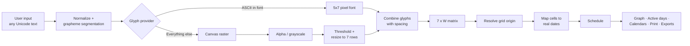
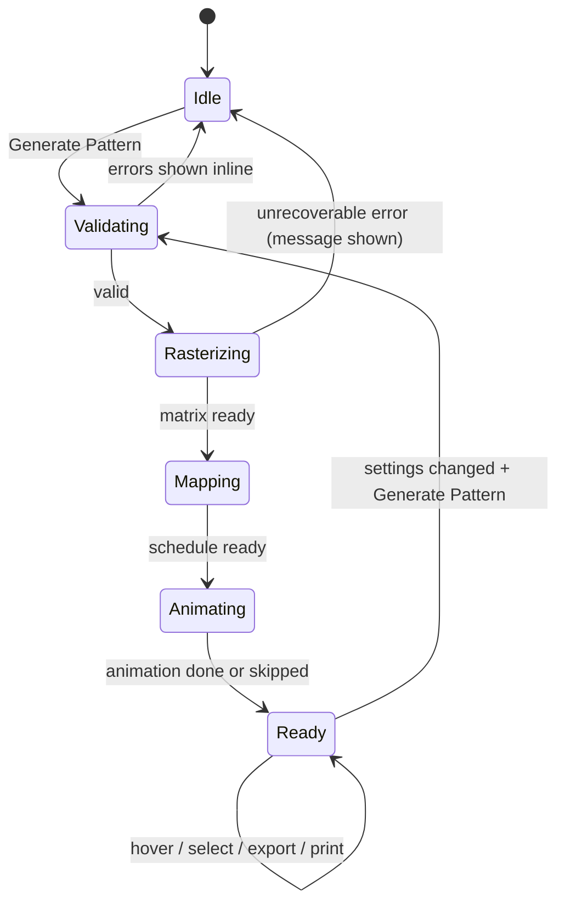
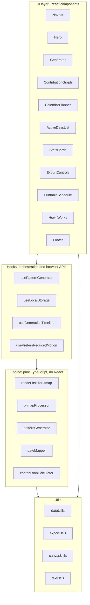

<div align="center">

# GlyphForge

**Turn anything into contribution art.**

*Forge your contribution history into a visual signature.*

[](https://glyph-forge-beryl.vercel.app/)
[](https://github.com/kambojmayan-png/GlyphForge)
[](https://opensource.org/licenses/MIT)

**🌐 Live Application:** [https://glyph-forge-beryl.vercel.app/](https://glyph-forge-beryl.vercel.app/)  
**📦 GitHub Repository:** [https://github.com/kambojmayan-png/GlyphForge](https://github.com/kambojmayan-png/GlyphForge)

</div>

---

## Contents

1. [Project title](#1-project-title)
2. [One-line description](#2-one-line-description)
3. [Project overview](#3-project-overview)
4. [Problem statement](#4-problem-statement)
5. [Why the project exists](#5-why-the-project-exists)
6. [Core idea](#6-core-idea)
7. [Features](#7-features)
8. [User flow](#8-user-flow)
9. [Screens and UI description](#9-screens-and-ui-description)
10. [Animation system](#10-animation-system)
11. [Text-to-pixel algorithm](#11-text-to-pixel-algorithm)
12. [Contribution date-mapping algorithm](#12-contribution-date-mapping-algorithm)
13. [Calendar planner logic](#13-calendar-planner-logic)
14. [Printable schedule behavior](#14-printable-schedule-behavior)
15. [Export system](#15-export-system)
16. [Unicode support](#16-unicode-support)
17. [Edge cases](#17-edge-cases)
18. [Accessibility](#18-accessibility)
19. [Responsive behavior](#19-responsive-behavior)
20. [Tech stack](#20-tech-stack)
21. [Architecture](#21-architecture)
22. [File structure](#22-file-structure)
23. [Algorithm pseudocode](#23-algorithm-pseudocode)
24. [Testing strategy](#24-testing-strategy)
25. [Deployment & Live Demo](#25-deployment--live-demo)
26. [Local development](#26-local-development)
27. [Example usage](#27-example-usage)
28. [Example input and output](#28-example-input-and-output)
29. [Limitations](#29-limitations)
30. [Future improvements](#30-future-improvements)
31. [Screenshots](#31-screenshots)
32. [License](#32-license)

**Conventions.** MUST, SHOULD and MAY are used in their RFC 2119 sense. "MVP" means required for the first release. Anything under [Future improvements](#30-future-improvements) is explicitly *not* part of the MVP. Every number in the worked examples (widths, active-day counts, dates) was computed from the glyph table in this document, not estimated.

---

## 1. Project title

**GlyphForge**

- Tagline: *Turn anything into contribution art.*
- Supporting line: *Forge your contribution history into a visual signature.*

The product name is **GlyphForge** everywhere: UI, page title, print header, CSV metadata, package name (`glyphforge`), repository topics. No other working name appears in the product.

---

## 2. One-line description

GlyphForge is a browser-only planner that converts text, emoji, dates and Unicode into a contribution-calendar pixel pattern and tells you the exact calendar days to be active so your graph gradually forms that pattern.

---

## 3. Project overview

GlyphForge takes anything the user types (`MAYAN`, `2026`, `04/10/2006`, `❤️`, `🚀`, `#`, `मायन`, `こんにちは`, `你好`, Arabic text) and rasterizes it into a binary (optionally 4-level) pixel matrix that is **7 rows tall**, one row per weekday, and as many columns as needed, one column per week. Each active pixel is mapped to a real calendar date. The user gets:

1. A GitHub/LeetCode-style contribution graph preview of the artwork.
2. The exact list of active dates, grouped by month.
3. A traditional month-by-month calendar with the active days marked, laid out so it can be **printed on A4/Letter and kept on a desk**.
4. Exports: copy dates, copy schedule as text, CSV, PNG of the pattern, and a print / save-as-PDF layout.
5. A plain-language explanation of how the pattern was constructed.

**GlyphForge is a planner, not an automator.** It never talks to GitHub or LeetCode, never authenticates, never creates a commit or submission. The user performs the real activity. Everything runs in the browser; there is no backend.

### 3.1 Decisions made in this specification

The product brief left some points open. These are the resolutions, so an implementer does not have to guess. Each is referenced later by its ID.

| ID | Topic | Decision |
|----|-------|----------|
| D-01 | Planner vs automator | Planner only. No OAuth, no API calls, no commit creation, no backdating. |
| D-02 | Week start (what "row 0" is) | Each platform profile declares `weekStartsOn`. **GitHub: Sunday** (row 0 = Sunday, row 6 = Saturday). **Generic: Monday** by default, user-switchable. **LeetCode: Sunday, flagged unverified** (see [Limitations](#29-limitations)). The *printed calendar's* first weekday is a separate setting (default Monday). |
| D-03 | Start date semantics | The user's start choice defines a **not-before date**. The grid origin is the first week-start on or after the week containing it, shifted forward by whole weeks until no active cell falls before the not-before date. The pattern never asks for activity in the past relative to the chosen start. See [section 12](#12-contribution-date-mapping-algorithm). |
| D-04 | Rasterizer | **Hybrid.** Characters covered by the built-in hand-tuned 5×7 pixel font (ASCII letters, digits, common punctuation, a heart) use it, because downsampling anti-aliased text to 7 rows is illegible. Everything else (emoji, CJK, Indic, Arabic, symbols) goes through the canvas pipeline: render, grayscale/alpha, threshold, resize to 7 rows. Users can force either mode. |
| D-05 | Date arithmetic | A calendar date has no time zone. Dates are stored as `YYYY-MM-DD` strings and computed in UTC with `date-fns` + `@date-fns/utc`, so DST can never shift a cell. Only "today" is read from the local clock (or the user-selected time zone). |
| D-06 | Line breaks | The grid is 7 rows tall, so lines cannot stack. Each line becomes a segment placed **left to right**, separated by a configurable line gap. |
| D-07 | Preview intensity levels | Preview colours are **relative to the pattern's own maximum**, mirroring how GitHub scales its greens. A uniform pattern renders at the top level. |
| D-08 | PDF | No PDF library. "Print / Save as PDF" opens the browser print dialog on a dedicated print layout. |
| D-09 | Platform differences | Platform behaviour lives in data (`PlatformProfile`), not in `if (platform === ...)` branches in the engine. |
| D-10 | Contribution day boundary | GitHub documents that contributions are timestamped in **UTC**, not local time. The UI shows a time-zone advisory (the local-time window in which "today locally" equals "today in UTC"). |
| D-11 | Dates in examples | All worked examples use the real output of the specified font and algorithm. |

### 3.2 Glossary

| Term | Meaning |
|------|---------|
| **Cell** | One square of the contribution graph = one calendar day. |
| **Row** | Weekday position inside a column, `0..6`. Row 0 is the platform's week-start day. |
| **Column** | One week, `0..W-1` inside the pattern. |
| **Matrix** | 7 × W array of intensity levels `0..4`. `0` = inactive. |
| **Active day** | A cell whose level is greater than 0. |
| **Level** | Intensity step `0..4`, mapped to a required number of contributions. |
| **Grid origin** | The calendar date of row 0 of the first grid column. Always a week-start day. |
| **Not-before date** | The earliest date on which the user is willing to be active. |
| **Column offset** | Number of empty weeks inserted before the pattern (used by alignment). |
| **Glyph** | The pixel bitmap for one grapheme cluster. |
| **Run** | A sequence of graphemes rendered by one provider (pixel font or canvas). |

---

## 4. Problem statement

Contribution graphs are a popular, highly visible signal of consistency. People want to shape them deliberately: spell a name, mark a milestone, draw a symbol. Doing that by hand is error-prone:

- The graph is a 7-row, week-per-column grid, so every letter has to be designed pixel by pixel.
- Mapping pixels to dates means doing weekday and month arithmetic across month ends, year ends, leap years and week-start conventions.
- Nothing produces a **schedule a human can follow day to day**, such as a printable calendar with the active days highlighted.
- Non-Latin scripts and emoji are effectively impossible to hand-draw at 7 rows.

---

## 5. Why the project exists

- **Useful.** It removes the date arithmetic and the pixel-art effort, and produces a plan that is easy to follow.
- **Honest.** It states clearly that the graph is an *intended* pattern and that platforms differ in how they render it (see [Limitations](#29-limitations)).
- **Portfolio-grade.** It demonstrates canvas image processing, careful date handling, accessible interactive visualisation, print-quality CSS, animation discipline, export features, testing and CI/CD on a static host.
- **Inclusive by design.** Unicode, right-to-left scripts, complex scripts and emoji are first-class inputs with graceful, honest fallbacks.

---

## 6. Core idea

```
TEXT  →  PIXELS  →  CONTRIBUTION GRAPH  →  DATES  →  SCHEDULE
```



One matrix, many views: the contribution graph, the active-day list, the month calendars, the CSV, the PNG and the print sheet are all derived from the same `Schedule` object, so they can never disagree.

---

## 7. Features

### 7.1 MVP feature list

Every visible control MUST work. No placeholder buttons.

| ID | Feature | Notes |
|----|---------|-------|
| F-01 | Free-text input | Any Unicode, line breaks allowed, live character count, example chips. |
| F-02 | Platform selection | GitHub, LeetCode, Generic. Presets for week start, wording ("contribution" vs "submission") and column-limit warnings. No claim of integration. |
| F-03 | Start-date options | Custom date, next Monday, next available full week, preferred month/year. |
| F-04 | Style options | Compact / Normal / Wide, plus character spacing, column stretch, density, intensity, shading, invert, alignment, render mode. |
| F-05 | Pattern generation | Deterministic: same input and settings give the same output. |
| F-06 | Generation animation | Text → pixels → graph → dates → schedule, skippable, reduced-motion aware. |
| F-07 | Contribution graph preview | Month labels, weekday labels, hover tooltip, selected-date state, dark and light themes, keyboard navigable. |
| F-08 | Exact active days | Grouped by month, chronological, copyable. |
| F-09 | Month-by-month calendar | Traditional grid with active days marked; month navigation. |
| F-10 | Printable schedule | Dedicated print layout, A4 and Letter, portrait and landscape, black-and-white safe. |
| F-11 | Visual monthly planner | Per-month active/remaining counts; click a day to see its pixel position and letter. |
| F-12 | Stats cards | Active days, total contributions, weeks, start, end, width, height, with count-up. |
| F-13 | Exports | Copy dates, copy schedule text, CSV, PNG, print / save as PDF. |
| F-14 | Fallback and warning system | Unrenderable glyphs, emoji variance, very wide patterns, low-fidelity glyphs. |
| F-15 | Persistence | Last settings and per-plan "done" ticks in `localStorage`, with an in-memory fallback. |
| F-16 | Time-zone advisory | Shows the local-time window that maps to the intended UTC day. |
| F-17 | Theme | Dark by default, light and system options. |
| F-18 | How It Works | Seven-step animated explainer. |
| F-19 | Accessibility | Keyboard-operable graph, live regions, reduced motion, non-colour encoding. |

### 7.2 Default settings (single source of truth)

All sections of this document refer to these defaults. They live in `src/engine/defaults.ts`.

| Setting | Type | Default | Range / values |
|---------|------|---------|----------------|
| `text` | string | `""` | up to 120 grapheme clusters |
| `platform` | enum | `github` | `github`, `leetcode`, `generic` |
| `startMode` | enum | `nextFullWeek` | `custom`, `nextMonday`, `nextFullWeek`, `preferredMonth` |
| `startDate` | ISO date | none | valid calendar date |
| `preferredMonth` | `{year, month}` | none | month `1..12`, year `1970..9999` |
| `sizePreset` | enum | `normal` | `compact`, `normal`, `wide` |
| `charSpacing` | int | from preset | `0..4` blank columns between glyphs |
| `wordSpacing` | int | from preset | `2..8` blank columns between words |
| `lineGap` | int | `6` | `3..12` blank columns between lines |
| `columnStretch` | int | `1` | `1..3` (each pixel column repeated N times) |
| `density` | int | `0` | `-2..+2` (threshold bias) |
| `intensity` | int | `1` | `1..4` (contributions per active day via `CONTRIBUTIONS_PER_LEVEL`) |
| `shading` | bool | `false` | multi-level output for canvas-rendered glyphs |
| `invert` | bool | `false` | inverts inside bounding box + padding |
| `alignment` | enum | `left` | `left`, `center`, `right` inside the platform window |
| `renderMode` | enum | `auto` | `auto`, `pixel`, `canvas` |
| `padding` | int | `0` (`1` when `invert`) | `0..3` blank columns each side |
| `weekStartsOnOverride` | `0..6` or null | `null` | only honoured for `generic` |
| `printWeekStart` | `0` or `1` | `1` (Monday) | first weekday of printed calendars |
| `timeZone` | IANA string | browser zone | any valid IANA zone |
| `animation` | enum | `full` | `full`, `reduced`, `off` (forced `reduced` by OS setting) |
| `theme` | enum | `dark` | `dark`, `light`, `system` |

Size presets:

| Preset | `charSpacing` | `wordSpacing` | canvas `xScale` |
|--------|---------------|---------------|-----------------|
| Compact | 1 | 3 | 0.85 |
| Normal | 1 | 4 | 1.00 |
| Wide | 2 | 6 | 1.25 |

`CONTRIBUTIONS_PER_LEVEL = [0, 1, 3, 6, 10]`. With the default intensity of 1, every active day requires **1** contribution, so "active days" equals "estimated contribution count".

---

## 8. User flow

1. The user opens GlyphForge and sees an animated landing page whose hero demonstrates the product (a calendar forming sample text).
2. They enter text, a symbol, an emoji or Unicode in the generator. A live mini-preview of the pixel matrix updates as they type (debounced 200 ms).
3. They choose a platform: **GitHub**, **LeetCode** or **Generic**.
4. They choose when to start: custom date, next Monday, next available full week, or a preferred month/year.
5. They optionally adjust style settings.
6. They press **Generate Pattern**.
7. The app validates input and dates. Problems are shown inline, next to the field, in plain language, and generation does not start.
8. The app rasterizes the input, builds the matrix, resolves the grid origin and maps cells to dates.
9. The generation animation plays (skippable): **TEXT → PIXELS → CONTRIBUTION GRAPH → DATES**.
10. A status message appears: **"Pattern generated successfully."**
11. The results appear: summary and stats, contribution graph, exact active days, monthly planner, printable calendar.
12. The user hovers, focuses or taps cells and days to see what is required on each date.
13. They print the schedule, copy the dates, export CSV, download the PNG.
14. They change settings and regenerate. Previous settings are remembered.



A new generation request cancels any in-flight one (`AbortController`), so a fast double-click can never display a stale result.

---

## 9. Screens and UI description

The product brief names visual references (GitHub, Vercel, Linear, Raycast, premium AI tools) and a dark-first, developer-focused, premium feel. This section turns that into concrete, checkable decisions.

### 9.1 Design principles

1. **The artwork is the hero.** The memorable element is the contribution grid itself, forming real text. Everything around it stays quiet.
2. **Structure carries information.** Borders, dividers and numbering appear only when they encode something (for example, numbered steps only in *How It Works*, which really is a sequence).
3. **Dark-first, light supported.** Both themes ship in the MVP and are tested.
4. **One accent.** Contribution green. Amber is used only for warnings and red only for errors. No rainbow gradients, no glassmorphism, no decorative blobs. A single faint radial green glow behind the hero demo is the only gradient allowed.
5. **Elevation by surface step and border, not by shadow.** Soft shadows are reserved for floating layers (tooltip, popover, toast).
6. **Plain, specific copy.** Buttons say what happens. Errors say what went wrong and how to fix it. Sentence case, except the exact strings mandated by the brief (listed in [9.4](#94-microcopy)).

### 9.2 Design tokens

Defined as CSS custom properties on `:root`, overridden under `[data-theme="light"]`. Tailwind reads them through its theme config so utilities and raw CSS share one source.

**Colour, dark theme**

| Token | Value | Notes |
|-------|-------|-------|
| `--gf-bg` | `#0a0f14` | page |
| `--gf-surface` | `#111820` | cards, inputs |
| `--gf-surface-raised` | `#161f29` | popovers, hovered cards |
| `--gf-border` | `#2a3948` | all borders |
| `--gf-text` | `#e6edf3` | 15.1:1 on `--gf-surface` |
| `--gf-text-muted` | `#9aa7b4` | 7.3:1 on `--gf-surface` |
| `--gf-warn` | `#e3b341` | 9.2:1 on `--gf-surface` |
| `--gf-error` | `#ff8b84` | 7.9:1 on `--gf-surface` |
| `--gf-focus` | `#6cb6ff` | focus ring, must stay ≥ 3:1 against adjacent surfaces |
| `--gf-level-0` | `#202b36` | empty cell |
| `--gf-level-1` | `#2a8450` | 3.09:1 vs level 0 |
| `--gf-level-2` | `#3fa96b` | 4.86:1 vs level 0 |
| `--gf-level-3` | `#63cf8c` | 7.42:1 vs level 0 |
| `--gf-level-4` | `#a3f0bd` | 10.79:1 vs level 0 |

**Colour, light theme**

| Token | Value | Notes |
|-------|-------|-------|
| `--gf-bg` | `#f6f8fa` | page |
| `--gf-surface` | `#ffffff` | cards, inputs |
| `--gf-border` | `#d0d7de` | |
| `--gf-text` | `#1f2328` | 15.8:1 on white |
| `--gf-text-muted` | `#59636e` | 6.1:1 on white |
| `--gf-focus` | `#0969da` | |
| `--gf-level-0` | `#e3e8ed` | empty cell |
| `--gf-level-1` | `#4fae71` | 2.23:1 vs level 0 (below 3:1, see note) |
| `--gf-level-2` | `#33965a` | 3.01:1 vs level 0 |
| `--gf-level-3` | `#1f7740` | 4.52:1 vs level 0 |
| `--gf-level-4` | `#115429` | 7.33:1 vs level 0 |

> The ratios above were computed with the WCAG relative-luminance formula. A unit test (`contrast.test.ts`) recomputes them from the tokens so a palette edit cannot silently break accessibility. Level 1 in the light theme is below 3:1 against an empty cell, so **active state never relies on fill colour alone**: active cells also carry a 1 px outline in `--gf-text` at 40% opacity, and the "Pattern marks" toggle (section 18) adds a centre dot. Because preview levels are relative to the pattern maximum (D-07), a default uniform pattern renders at level 4 anyway.

**Typography**

| Role | Family | Fallback | Use |
|------|--------|----------|-----|
| UI and headings | Geist (variable, self-hosted) | `ui-sans-serif, system-ui, sans-serif` | everything |
| Data | JetBrains Mono (self-hosted) | `ui-monospace, SFMono-Regular, Menlo, monospace` | dates, counts, CSV preview, pixel positions |

Type scale (rem): `0.75, 0.875, 1, 1.125, 1.25, 1.5, 2, 3` and a fluid hero size `clamp(2.5rem, 6vw + 1rem, 4.5rem)`. Body line length ≤ 70 characters. Tabular numerals (`font-variant-numeric: tabular-nums`) for every changing number.

**Shape, space, motion**

| Token | Value |
|-------|-------|
| Spacing unit | 4 px; section rhythm 96 px desktop, 64 px mobile |
| Radius: graph cell / control / card / panel | 3 px / 8 px / 12 px / 16 px |
| `--dur-fast` / `--dur-base` / `--dur-slow` | 150 ms / 250 ms / 500 ms |
| `--ease-out` | `cubic-bezier(0.2, 0.8, 0.2, 1)` |
| `--ease-spring` | CSS `linear()` approximation of a light spring, fallback `cubic-bezier(0.34, 1.56, 0.64, 1)` |
| Floating-layer shadow | `0 8px 24px rgb(0 0 0 / 0.35)` dark, `0 8px 24px rgb(31 35 40 / 0.15)` light |

### 9.3 Page anatomy

```
┌──────────────────────────────────────────────────────────────────────────┐
│ ▦ GlyphForge      Generator   How It Works   About        GitHub   ◐     │  Navbar (sticky)
├──────────────────────────────────────────────────────────────────────────┤
│                                                                          │
│  Turn anything into                    ┌────────────────────────────┐    │
│  contribution art.                     │ ▢▢▣▢▢▣▣▣▢▢▣▢▣▢▢▣▣▣▢ ...    │    │  Hero
│                                        │ ▢▣▢▣▢▣▢▢▢▣▣▣▣▣▢▣▢▢ ...    │    │  (live demo of
│  Convert names, dates, symbols,        │ ▢▣▣▣▢▣▢▢▢▣▢▢▣▢▢▣▢▢ ...    │    │  text forming
│  emojis, and Unicode text into a       │ ▢▣▢▣▢▣▣▣▢▣▢▢▣▢▢▣▣▣ ...    │    │  in the grid)
│  contribution-calendar pattern...      └────────────────────────────┘    │
│  [ Create Your Pattern ] [ See How It Works ]      showing: MAYAN        │
├──────────────────────────────────────────────────────────────────────────┤
│  GENERATOR                                                               │
│  ┌ text ────────────────────────────┐  Platform ( )GitHub ( )LeetCode…   │
│  │ MAYAN                    5 chars │  Start    [custom ▾] [2026-10-12]   │  Generator
│  └──────────────────────────────────┘  Style    Compact | Normal | Wide   │
│  chips: MAYAN  2026  ❤️  🚀  मायन  こんにちは  你好   ▸ More options      │
│  live matrix preview ▢▣▣▣▢ …                    [ Generate Pattern ]     │
├──────────────────────────────────────────────────────────────────────────┤
│  Summary + Stats cards                                                   │
│  Contribution graph (scrolls horizontally when wide)                     │  Results
│  Exact active days (by month)   │   Monthly planner (calendar)           │
│  Printable schedule  ·  Exports bar                                      │
├──────────────────────────────────────────────────────────────────────────┤
│  How It Works (7 steps)                                                  │
│  About · Footer                                                          │
└──────────────────────────────────────────────────────────────────────────┘
```

### 9.4 Microcopy

Strings marked **(mandated)** come verbatim from the product brief and MUST NOT be reworded.

| Where | Copy |
|-------|------|
| Hero headline **(mandated)** | Turn anything into contribution art. |
| Hero supporting text **(mandated)** | Convert names, dates, symbols, emojis, and Unicode text into a contribution-calendar pattern and get the exact days you need to be active. |
| Primary CTA **(mandated)** | Create Your Pattern |
| Secondary CTA **(mandated)** | See How It Works |
| Generate button **(mandated)** | Generate Pattern |
| Copy button **(mandated)** | Copy Dates |
| Copy confirmation **(mandated)** | Copied! |
| Success message **(mandated)** | Pattern generated successfully. |
| Very-wide warning **(mandated)** | This pattern is very wide and may require more than one contribution year. |
| Empty input | Enter some text to turn into a pattern. |
| Whitespace only | Add at least one visible character. |
| Invalid date | That date doesn't exist. Pick a valid date, for example 2026-10-12. |
| Nothing drawable | Nothing in this input could be drawn. Try different characters or switch the render mode to Canvas. |
| Unsupported glyph | Your browser couldn't draw "{char}". It was replaced with a placeholder, so the pattern won't show that character. |
| Emoji variance | Emoji look different on each browser and operating system, so your pattern may not match what you see elsewhere. |
| Low fidelity | "{char}" has more detail than 7 rows can hold. It may be hard to recognise. |
| Download | Downloaded {filename}. |
| Clipboard failure | Couldn't copy automatically. The text is selected below so you can copy it yourself. |
| Past dates | {n} of these days are already in the past, so they can't be planned. |

Errors never apologise and never blame the user; each states the problem and the fix.

### 9.5 Section 1: Navbar

- Contents: logo mark + "GlyphForge", **Generator**, **How It Works**, **About**, project link, theme toggle.
- The logo mark is a 5×5 contribution-cell "G" produced by the same engine (the product eats its own output). A matching SVG favicon is committed to `public/`.
- The project link reads its URL from `VITE_REPO_URL`. If the variable is unset, the link is not rendered. The repository URL is never hard-coded.
- Behaviour: sticky. Height 64 px, shrinking to 52 px after 24 px of scroll; a 1 px bottom border fades in after 8 px of scroll. The current section is highlighted (`IntersectionObserver`). Anchor links use smooth scrolling unless reduced motion is on, and account for the sticky height with `scroll-margin-top`.
- Mobile (< 768 px): logo, theme toggle and a menu button opening a full-width sheet with the same links. The sheet traps focus, closes on Escape and on link activation.

### 9.6 Section 2: Hero

- Two columns on desktop (copy left, live demo right), stacked on tablet and mobile with the demo above the CTAs on mobile.
- **The demo is the product, running.** An animated contribution grid forms sample text column by column, holds, then clears. It cycles `MAYAN` → `2026` → `❤` → `你好`, using the real engine (so the hero doubles as a smoke test). Clicking or pressing Space on the demo pauses and resumes it. The current sample is labelled underneath. See [10.2](#102-landing-page-motion).
- Behind the hero, an ambient layer of faint cells slowly appears and disappears on a single `<canvas>` (not DOM nodes).
- Accessibility: the demo is decorative (`aria-hidden="true"`) with an adjacent visually-hidden sentence describing it. Pause/resume is a real `<button>` with an accessible name.

### 9.7 Section 3: Generator

**Input area**
- A large `<textarea>`, auto-growing from 2 to 6 rows, with a live character counter (graphemes, not UTF-16 units: `🚀` counts as 1).
- Line breaks allowed (D-06). The counter turns amber at 100 graphemes and the field refuses input past 120.
- Example chips insert text on click: `MAYAN`, `MAYAN 19`, `HELLO WORLD`, `2026`, `#`, `❤️`, `🚀`, `मायन`, `こんにちは`, `你好`. Chips are real buttons.
- A live mini-preview (7-row matrix, no dates) updates 200 ms after typing stops.

**Platform** (radio group): GitHub, LeetCode, Generic. A one-line note under the group explains the selected profile's assumptions, for example "Rows run Sunday to Saturday. Days are counted in UTC." LeetCode shows an "Unverified profile" tag. The UI never says GlyphForge is *connected to* either service.

**Date settings**
- Mode selector: *Custom start date*, *Start next Monday*, *Start next available full week*, *Preferred month and year*.
- Native `<input type="date">` for custom dates, wrapped so manual typing is validated through the strict parser in [12.2](#122-parsing-and-validation).
- After any change, a one-line preview shows the resolved result, for example: "Grid starts Sunday 18 Oct 2026 (your date was Monday 12 Oct; the pattern needs a Sunday start)."

**Style settings**
- Segmented control: Compact / Normal / Wide.
- "More options" disclosure: character spacing, column stretch, density, intensity, shading, invert, alignment, render mode, line gap, padding. Every control has a visible label, a value readout and a reset-to-default affordance.

**Generate button**: large, full width on mobile, labelled **Generate Pattern**. While generating it shows determinate progress by phase (validate, rasterize, map) and is `aria-busy`. It is disabled only while a generation is in flight, never because of a validation problem (so errors can be read and fixed).

### 9.8 Section 4: Text-to-pixel processing (UI)

A collapsible "Show how this was built" panel under the generator shows, for the current input, the intermediate stages: normalized text → per-glyph bitmaps → combined matrix. Each canvas-rendered glyph shows its **fidelity estimate** and any warning. The conceptual pipeline is specified in [section 11](#11-text-to-pixel-algorithm).

### 9.9 Section 5: Contribution graph preview

- Rounded cells (3 px radius), 3 px gap, levels 0 to 4, month labels along the top, weekday labels (alternate rows) on the left, optional legend ("Less ▢▢▢▢▢ More").
- Rendered as inline **SVG** (`<rect>` per cell). It is crisp at any zoom, directly printable, and each cell can be focusable.
- Theme: dark by default, switchable independently of the page theme for the exported PNG.
- **Hover/focus tooltip** contents: full date (`November 4, 2026`), state (`Active day` or `No contribution required`), required contributions (`Required contributions: 1`), and pixel position (`Column 3 of 29, row 4 of 7`). The tooltip is hoverable, dismissible with Escape, and never obscures the focused cell.
- **Selected state**: click or Enter/Space pins a cell (ring + persistent detail card). The same date is highlighted in the planner and the active-day list.
- **Zoom**: cell size slider (8 to 20 px). Wide patterns scroll horizontally inside their own container with edge fades and a sticky weekday-label column.
- **Reveal**: staggered left-to-right (see [section 10](#10-animation-system)).

### 9.10 Section 6: Exact active days

- A dedicated panel titled **Active days**. Grouped by month with a heading per month (`October 2026`), chronological, one chip per day (`18 Oct`, with the weekday on wider screens).
- Each month heading shows its count. A **Copy Dates** button sits at the top of the panel and a smaller one per month.
- Chips are focusable; activating one pins the matching cell in the graph and scrolls it into view.
- Past days are visually muted and labelled "past" in text (not colour alone).
- Output sample:

```
ACTIVE DAYS

October 2026 (8)
18 Oct · 19 Oct · 20 Oct · 21 Oct · 22 Oct · 23 Oct · 24 Oct · 26 Oct

November 2026 (11)
3 Nov · 4 Nov · 9 Nov · 15 Nov · ...
```

### 9.11 Sections 7 and 8: Monthly calendar, printable schedule, visual planner

Specified in detail in [section 13](#13-calendar-planner-logic) and [section 14](#14-printable-schedule-behavior). On screen:

- The **Visual monthly planner** is a dashboard-style card per month: month name, `Active: N days`, `Remaining: M days`, a traditional month grid, previous/next month buttons, and keyboard navigation.
- Clicking an active day opens a detail popover: the date, "Make {n} {contribution|submission}(s) on this day", the pixel position (column and row), and the originating glyph ("Part of the 3rd letter, Y, column 2 of 5").
- A "Mark done" checkbox in the popover persists per plan in `localStorage`.

### 9.12 Section 9: Exports bar

A single toolbar: **Copy Dates**, **Copy schedule**, **Export CSV**, **Download PNG**, **Print / Save as PDF**. It is sticky at the bottom on mobile. Each action gives immediate feedback in a polite live region and a transient toast ("Copied!", "Downloaded {filename}."). Details in [section 15](#15-export-system).

### 9.13 Section 10: How It Works

Seven steps, rendered as a real sequence (numbered, because it is one), each with a small animated illustration that plays once when scrolled into view:

1. **Enter text.** Characters appear in a mono field.
2. **Text is converted into pixels.** A letter dissolves into its 5×7 cells.
3. **Pixels become contribution cells.** The cells settle into a 7-row column layout.
4. **Cells are mapped to real dates.** Date labels attach to the cells.
5. **The activity schedule is generated.** The active dates collect into a monthly list.
6. **You follow the schedule.** A calendar day gets ticked.
7. **The graph gradually forms the pattern.** Cells fill in over time until the text is visible.

Under the steps, a short note states the limitation (the graph is an *intended* pattern; platforms differ).

### 9.14 Section 11: Stats

Cards: **Active days**, **Total contributions**, **Number of weeks**, **Start date**, **End date**, **Pattern width**, **Pattern height**. Numeric cards count up over 600 ms (`easeOutCubic`) when results first appear; with reduced motion they show the final value immediately. Dates are formatted by `Intl.DateTimeFormat`, never hand-assembled.

### 9.15 About and footer

- About: what GlyphForge is, what it is not (a planner, not an automator), how contribution graphs differ by platform, a responsible-use note, and a statement that it is **not affiliated with or endorsed by GitHub or LeetCode**. Platform names are used descriptively only; no third-party logos.
- Footer: "Generated by GlyphForge" tagline, repo link (env-driven), version, licence link, privacy line ("Everything runs in your browser. Nothing you type leaves your device.").

---

## 10. Animation system

Animation is a core part of the product but is governed by a **motion budget** so it stays tasteful:

| Tier | What | Rule |
|------|------|------|
| Ambient | Hero demo loop, faint background cells | One continuous motion area at a time; pauses when off-screen, hidden tab, or paused by the user |
| Orchestrated | The generation sequence | The single big moment; skippable; plays once per generation |
| Responsive | Hover, focus, press, copy/download confirmation, tooltips, popovers, month navigation | Always tied to a user action; 150 to 250 ms |
| Reveal | Scroll-in for *How It Works* illustrations and result sections | Plays once, never repeats on scroll-up |

### 10.1 Technical rules

- Animate **only `transform` and `opacity`** (and colour via class swap on small elements). Never animate `width`, `height`, `top`, `left`, `box-shadow`, `filter` or layout-affecting properties.
- Prefer CSS transitions and keyframes; use the Web Animations API only for sequencing that CSS cannot express. No animation library is required.
- Stagger via a CSS custom property: `style="--i: {columnIndex}"` and `animation-delay: calc(var(--i) * var(--stagger))`.
- **Stagger cap:** `--stagger = min(24ms, 800ms / columns)`, so the whole sweep never exceeds ~800 ms regardless of pattern width.
- At most ~400 elements animate simultaneously; for wider graphs the reveal is applied per column group.
- `will-change` is set just before an animation starts and removed on `animationend`. `contain: layout paint` on the graph container.
- Phase transitions are driven by `animationend`/`transitionend` events and a pure phase state machine, not chained `setTimeout`s, so skipping and cancelling are exact.
- Durations: 150 to 500 ms for UI transitions. Springy easing only for press/pop micro-interactions.

### 10.2 Landing page motion

| Element | Behaviour |
|---------|-----------|
| Hero headline | One-time reveal on load: words rise 12 px and fade in, 60 ms apart, 400 ms each. Nothing else on the page uses this entrance. |
| Hero demo | Real engine output sweeping in column by column (about 24 ms per column), 2.5 s hold, reverse sweep out, next sample. Click/Space pauses. |
| Background cells | A single `<canvas>`: sparse low-contrast cells fade in and out slowly. Capped at 30 fps, paused with `IntersectionObserver` when the hero is off-screen and with `visibilitychange` when the tab is hidden. Static when reduced motion is on. |
| CTA buttons | Press: scale to 0.98 with `--ease-spring` on release. Hover: arrow nudges 3 px. |
| Cards | Hover: border brightens and the card lifts 2 px (`transform`). Not applied to every element, only interactive cards. |
| Anchor navigation | Smooth scroll; disabled under reduced motion. |
| Optional floating particles | If included, they are the same canvas as the background cells, never a second animation loop. |

### 10.3 Generation sequence

Total target: about **3.2 s** for a typical pattern. A **Skip animation** button is shown throughout and the sequence is skipped automatically when columns > 120.

| Phase | Time | What the user sees | Technique |
|-------|------|--------------------|-----------|
| 0. Compress | 0 to 300 ms | The input card collapses to a single line showing the text. The button becomes a four-segment progress indicator. | `transform: scaleY`, `opacity` |
| 1. TEXT → PIXELS | 300 to 900 ms | The typed text appears large in the mono face and each glyph dissolves into its own pixel cells. | per-cell `scale` 0.4 → 1 and `opacity` 0 → 1, staggered by glyph |
| 2. PIXELS → GRAPH | 900 to 1700 ms | Pixel columns sweep left to right into the contribution graph; the graph populates and cells settle to their level colours. | column stagger (≤ 800 ms total), class-based colour change |
| 3. GRAPH → DATES | 1700 to 2300 ms | Month labels fade in, a thin scan line passes over the graph, date chips flip in over the first and last active columns. | `transform` on the scan line, `opacity` on labels |
| 4. Reveal schedule | 2300 to 3200 ms | Active-day list items cascade (first 12 animate, the rest appear instantly), stats count up. | capped stagger, `requestAnimationFrame` count-up |
| Done | 3200 ms | Polite live region announces **"Pattern generated successfully."** and a toast appears. Focus moves to the results heading. | `role="status"` |

The communicated transformation is always **TEXT → PIXELS → CONTRIBUTION GRAPH → DATES**.

Re-generation with unchanged text replays a shortened 800 ms version (phases 2 and 4 only).

### 10.4 Interaction animations

| Interaction | Behaviour |
|-------------|-----------|
| Graph cell hover | Cell scales to 1.15, tooltip fades/translates 4 px in over 150 ms |
| Graph cell click | Pin ring appears with a 200 ms spring; matching list chip and calendar day highlight |
| Active calendar day | Soft pulse once when highlighted from another view, then static |
| Month navigation | Outgoing month slides 16 px and fades; incoming mirrors; 250 ms; direction follows prev/next |
| Copy / download | Button label swaps to **Copied!** / **Downloaded**, icon morphs to a check for 1.5 s, then reverts |
| Number count-up | 600 ms `easeOutCubic`, tabular numerals so width never jitters |
| Section transitions | Results sections fade in as the sequence finishes; no per-section slide on scroll |

### 10.5 Reduced motion

Respect both the OS setting and the in-app **Animation** setting.

```css
@media (prefers-reduced-motion: reduce) {
  *, *::before, *::after {
    animation-duration: 0.01ms !important;
    animation-iteration-count: 1 !important;
    transition-duration: 0.01ms !important;
    scroll-behavior: auto !important;
  }
}
```

In addition, in JavaScript (`usePrefersReducedMotion`): the hero shows a static final frame, the generation sequence becomes a single 150 ms crossfade, count-ups show the final number, and the background canvas stops. Essential state changes (focus rings, pinned selection, confirmations) remain, without movement.

### 10.6 Performance budget

- Generation (rasterize + map) for a 120-grapheme input: under 250 ms on a mid-range laptop, measured in the test suite.
- Animations hold 50+ fps on a mid-range phone, verified in Chrome DevTools with 4× CPU throttling.
- No animation runs while the tab is hidden.
- Total JavaScript for the first view stays modest by lazy-loading the print layout, the PNG exporter and the "How It Works" illustrations.

---

## 11. Text-to-pixel algorithm

### 11.1 Conceptual pipeline

```
User input
   ↓
Unicode text                     normalize (NFC), strip control/bidi-override characters
   ↓
Segmentation                     lines → grapheme clusters → runs
   ↓
Canvas / text rendering          (non-pixel-font runs)    pixel font lookup (ASCII runs)
   ↓                                                           ↓
Raster image                     high-resolution alpha bitmap  5×7 glyph bitmap
   ↓
Grayscale conversion             alpha → coverage 0..1 (emoji: silhouette)
   ↓
Threshold / pixel extraction     coverage ≥ θ  (or quantize to levels 1..4 when shading is on)
   ↓
Resize to contribution-grid height   box filter to exactly 7 rows
   ↓
Binary / levelled contribution matrix   combine glyphs, spacing, lines, stretch, padding, invert
   ↓
Date mapping                     see section 12
```

The pixel-font branch skips the raster, grayscale and resize stages because its bitmaps are already 7 rows. It exists because anti-aliased text downsampled to 7 rows is unreadable for Latin letters (D-04).

### 11.2 Stage 0: normalization and validation

1. `text.normalize("NFC")`.
2. Normalize line endings (`\r\n`, `\r` → `\n`). Tabs become a single space.
3. Remove C0/C1 control characters except `\n` and report `CONTROL_STRIPPED`.
4. Remove bidirectional **override and isolate** controls (`U+202A..U+202E`, `U+2066..U+2069`) and report `BIDI_STRIPPED`. (They can visually reorder text unexpectedly and add nothing to the pattern.)
5. Replace lone surrogates with `U+FFFD` and report `LONE_SURROGATE`.
6. Trim leading/trailing whitespace on each line; drop empty lines at the start and end; collapse runs of spaces within a line into one word gap.
7. Reject empty or whitespace-only input with the friendly validation message (no generation).
8. Enforce the 120-grapheme limit (the textarea refuses further input; paste is truncated with a notice).
9. Reject characters in the Unicode categories **Cn** (unassigned) and **Co** (private use) up front, treating them as unsupported glyphs (see [11.5.6](#1156-missing-glyph-detection)).

### 11.3 Stage 1: segmentation and provider selection

1. Split on `\n` into **lines**.
2. Split each line into **grapheme clusters** using `Intl.Segmenter(undefined, { granularity: "grapheme" })`. This keeps emoji ZWJ sequences (`👨‍👩‍👧`), flags, skin-tone modifiers, keycaps, and combining sequences (Devanagari vowel signs, accents) intact. Where `Intl.Segmenter` is missing, a conservative fallback joins code points across `U+200D`, variation selectors, combining marks (`\p{M}`), emoji modifiers and regional-indicator pairs.
3. Choose the provider for each line:
   - If the line contains any **shaping-dependent or right-to-left** character (Arabic, Hebrew, and the Indic, Southeast-Asian and other joining/reordering scripts, see [section 16](#16-unicode-support)), render **the entire line as one canvas run**. Shaping, ligatures and bidi reordering are only correct when the text is drawn in a single call; per-character drawing would break them.
   - Otherwise, split into runs cluster by cluster: a cluster goes to the **pixel font** if every code point is covered by it (and `renderMode` is not `canvas`), else to the **canvas provider**. Adjacent clusters with the same provider form a run.
4. In `renderMode = pixel`, clusters not covered by the pixel font are *not* silently dropped: they use the canvas provider and a `NOT_IN_PIXEL_FONT` info message is shown.

### 11.4 Pixel font provider

**Format.** `src/engine/font5x7.ts` exports a map from character to seven equal-length strings of `0`/`1`, row 0 first. Glyph width is 1 to 7 columns (most are 5). Leading and trailing blank columns are trimmed when a glyph is loaded, so `I` becomes 3 columns wide and `-` stays 5 wide.

**Case.** Lowercase ASCII letters are folded to uppercase in `auto` and `pixel` modes (the font has capitals only). The UI says so beside the render-mode control. Use `canvas` mode to keep case.

**Required glyph table.** The complete set below is normative. Anything not listed (for example `, ; _ + & @ * ' " ( ) %`) SHOULD be added by the implementer under the same rules and is covered by the glyph validator test; until added it falls back to the canvas provider.

```
A 01110 10001 10001 11111 10001 10001 10001
B 11110 10001 10001 11110 10001 10001 11110
C 01110 10001 10000 10000 10000 10001 01110
D 11110 10001 10001 10001 10001 10001 11110
E 11111 10000 10000 11110 10000 10000 11111
F 11111 10000 10000 11110 10000 10000 10000
G 01110 10001 10000 10111 10001 10001 01111
H 10001 10001 10001 11111 10001 10001 10001
I 01110 00100 00100 00100 00100 00100 01110
J 00111 00010 00010 00010 00010 10010 01100
K 10001 10010 10100 11000 10100 10010 10001
L 10000 10000 10000 10000 10000 10000 11111
M 10001 11011 10101 10101 10001 10001 10001
N 10001 10001 11001 10101 10011 10001 10001
O 01110 10001 10001 10001 10001 10001 01110
P 11110 10001 10001 11110 10000 10000 10000
Q 01110 10001 10001 10001 10101 10010 01101
R 11110 10001 10001 11110 10100 10010 10001
S 01111 10000 10000 01110 00001 00001 11110
T 11111 00100 00100 00100 00100 00100 00100
U 10001 10001 10001 10001 10001 10001 01110
V 10001 10001 10001 10001 10001 01010 00100
W 10001 10001 10001 10101 10101 11011 10001
X 10001 10001 01010 00100 01010 10001 10001
Y 10001 10001 01010 00100 00100 00100 00100
Z 11111 00001 00010 00100 01000 10000 11111
0 01110 10001 10011 10101 11001 10001 01110
1 00100 01100 00100 00100 00100 00100 01110
2 01110 10001 00001 00010 00100 01000 11111
3 11111 00010 00100 00010 00001 10001 01110
4 00010 00110 01010 10010 11111 00010 00010
5 11111 10000 11110 00001 00001 10001 01110
6 00110 01000 10000 11110 10001 10001 01110
7 11111 00001 00010 00100 01000 01000 01000
8 01110 10001 10001 01110 10001 10001 01110
9 01110 10001 10001 01111 00001 00010 01100
# 01010 01010 11111 01010 11111 01010 01010
- 00000 00000 00000 11111 00000 00000 00000
. 0 0 0 0 0 0 1
! 1 1 1 1 1 0 1
? 01110 10001 00001 00010 00100 00000 00100
: 0 0 1 0 1 0 0
/ 00001 00010 00010 00100 01000 01000 10000
```

**Hand-tuned override glyphs** (looked up *before* the canvas provider, keyed by the cluster with `U+FE0F` removed):

```
♥ (U+2665), ❤ (U+2764), ❤️ (U+2764 U+FE0F)
0110110
1111111
1111111
1111111
0111110
0011100
0001000
```

A heart at 7×7 drawn by hand is far clearer than a downsampled emoji, so hearts bypass the canvas. Other emoji (for example `🚀`) use the canvas provider.

**Glyph validator (test-enforced).** Every glyph has exactly 7 rows; all rows in a glyph have equal length; characters are only `0` or `1`; every non-space glyph has at least one `1`.

### 11.5 Canvas provider

Used for emoji, CJK, symbols outside the pixel font, and every line that needs shaping.

#### 11.5.1 Rasterization

- Create a canvas through an injected `CanvasFactory` (`OffscreenCanvas` when available, otherwise `document.createElement("canvas")`; a Skia-based canvas in unit tests). `getContext("2d", { willReadFrequently: true })`.
- Constants: `RASTER_PX = 160` (font size in device pixels). Canvas height `= ceil(RASTER_PX * 1.8)`; width `= ceil(measureText(run).width + RASTER_PX * 0.5)`.
- Wait for fonts first: `await document.fonts.ready`, and `document.fonts.load("800 160px <stack>", sample)` for any self-hosted face in the stack.
- Draw black on a transparent canvas: `fillStyle = "#000"`, `textBaseline = "alphabetic"`, `textAlign = "left"`, `direction = "ltr" | "rtl"` (see [section 16](#16-unicode-support)). Weight 800 where the font has it. To keep thin strokes from vanishing during downsampling, additionally call `strokeText` with `lineWidth = RASTER_PX * 0.04`.
- Font stacks are chosen per script (see [section 16](#16-unicode-support)) and always end in a generic family.

#### 11.5.2 Grayscale conversion

The canvas is transparent, so **alpha is the coverage signal**: `coverage = alpha / 255`. This is equivalent to luminance on a white background but works for colour emoji, which are treated as **silhouettes**. (Detailed emoji shading is a future improvement.)

#### 11.5.3 Fit: choosing the vertical scale

1. Scan the alpha channel for the **ink bounding box** (`alpha > 16`).
2. **Ink fit** (default): scale so the ink height maps to 7 rows. `s = 7 / inkHeight`.
3. **Cap fit** for runs whose ink is very short (`inkHeight < 0.25 * RASTER_PX`, such as `-`, `.`, `_`): scale so `0.72 * RASTER_PX` (an approximate cap height) maps to 7 rows and align the **baseline to the bottom edge of row 6**. Punctuation then stays small and sits where it belongs instead of ballooning to fill 7 rows.
4. Target width `Wt = max(1, round(inkWidth * s * xScale))`, where `xScale` comes from the size preset (0.85 / 1.00 / 1.25).

#### 11.5.4 Resize: exact area-weighted box filter

For each target cell `(row, col)`, average the coverage over its source rectangle, with **fractional edge weights** (not nearest-neighbour, and not `drawImage` downscaling, whose quality varies by browser). Pseudocode is in [section 23](#23-algorithm-pseudocode). The output is a `7 × Wt` array of coverages in `0..1`.

#### 11.5.5 Threshold or shade

- **Binary** (default): `level = coverage ≥ θ ? intensity : 0`, with `θ = clamp(0.5 − 0.1 × density, 0.2, 0.8)`. Positive `density` lowers the threshold (bolder, more active cells).
- **Shaded** (`shading = true`): quantize coverage to levels 0 to 4 with thresholds `[0.2, 0.4, 0.6, 0.8]`. Shading uses the full level range, so the intensity control is disabled while it is on. This keeps anti-aliased edges, which often reads better for round glyphs and emoji, at the cost of needing different contribution counts on different days.
- **Never-empty rule:** if a non-whitespace glyph yields an empty matrix, retry with `θ = 0.25`, then `0.10`. If it is still empty, report it as a missing glyph.

#### 11.5.6 Missing-glyph detection

Browsers do not tell you when a font lacks a character, and many render a "tofu" box. GlyphForge detects it with heuristics, and the UI states they are heuristics:

1. **Category check:** `\p{Cn}` (unassigned) and `\p{Co}` (private use) are unsupported by definition. This also catches browsers that draw a hex-code box (their box differs per code point, so image comparison would not).
2. **Notdef probe:** render a known-unassigned reference code point (for example `U+10FFFF`) with the same font stack and size, hash its alpha bitmap (cropped to ink), and compare it with the target cluster's hash. A match means the browser drew its fallback box.
3. **Empty ink** for a non-whitespace cluster is treated as missing.
4. **Unjoined emoji sequence heuristic:** for a multi-code-point emoji cluster, if `measureText(cluster).width ≥ 1.8 × measureText(firstCodePoint).width`, the sequence probably fell apart into separate glyphs. Warn with `CLUSTER_NOT_COMPOSED`.

On detection: do **not** throw. Substitute a readable placeholder glyph (a hollow 5×7 box, defined in `font5x7.ts` as `__missing__`), emit `MISSING_GLYPH` with the cluster and its position, and tell the user plainly that the pattern will not show that character.

#### 11.5.7 Fidelity estimate

For every canvas-rendered run, compute an **estimated fidelity**: the intersection-over-union between (a) the final binary matrix, scaled back up to source resolution, and (b) the high-resolution mask (`alpha ≥ 128`) inside the ink box.

```
fidelity = |matrixOn ∧ maskOn| / |matrixOn ∨ maskOn|        (0..1)
```

- `< 0.55` → `LOW_FIDELITY` warning ("has more detail than 7 rows can hold").
- `< 0.35` → the warning wording becomes "probably unrecognisable".

The thresholds are tunable heuristics, kept as constants and adjusted against a golden sample set during development. The value is shown as an estimate, never as a guarantee.

### 11.6 Combining glyphs

Order of operations (each is a pure function in `bitmapProcessor.ts` or `patternGenerator.ts`):

1. **Glyph matrices** (7 rows, trimmed of blank edge columns).
2. **Join glyphs in a line:** insert `charSpacing` blank columns between adjacent glyphs; between words insert `wordSpacing` blank columns **in total** (not additional to the character gap).
3. **Join lines:** insert `lineGap` blank columns between lines (D-06).
4. **Trim** leading and trailing blank columns of the whole matrix.
5. **Column stretch:** repeat every column `columnStretch` times.
6. **Padding:** add `padding` blank columns on each side.
7. **Invert** (if enabled): inside the padded bounding rectangle, `level' = level === 0 ? maxLevel : maxLevel − level`.
8. Record **`ColumnMeta`** alongside: for every final column, its kind (`glyph`, `gap`, `lineGap`, `padding`, or later `offset`), which line, which grapheme cluster, and which column of that glyph it came from. This powers the "Part of the 3rd letter, Y" detail in the planner.

Invert warns about the number of active days it creates (it can be a large multiple of the non-inverted count).

### 11.7 Output

```ts
interface PatternMatrix {
  rows: 7;
  cols: number;                 // W
  levels: Uint8Array;           // row-major, length rows * cols, values 0..4
  meta: ColumnMeta[];           // length cols
  warnings: PatternWarning[];
  fidelity: { cluster: string; value: number }[];
}
```

### 11.8 Fit suggestions

When `cols` exceeds the platform's `softColumnLimit` (53 for year-view platforms), the UI shows the mandated warning and **actually computes** alternatives by re-running the generator with variants and reporting resulting widths, for example, for `HELLO WORLD` (62 columns at Normal, against the 53-column year view): "Compact: 61 columns. Compact with no character spacing: 53 (fits). Without the space: 59. Still too wide? Try a shorter text: about 9 capital letters fit at Normal spacing." Only variants that change the width are listed, and each has a one-click **Apply** button. Above 520 columns (about ten years) generation is refused.

### 11.9 Determinism and performance

- Same text, settings, fonts and browser produce the same matrix. (Canvas text rendering depends on installed fonts, so cross-machine determinism holds for the pixel font and not for canvas-rendered glyphs. See [Limitations](#29-limitations).)
- Rasterizing a 120-grapheme line completes in well under 250 ms; glyph bitmaps are memoized by `(cluster, fontStack, settings that affect raster)`.

---

## 12. Contribution date-mapping algorithm

### 12.1 Model

```ts
type IsoDate = string; // "YYYY-MM-DD", a calendar date with no time zone

interface PlatformProfile {
  id: "github" | "leetcode" | "generic";
  label: string;
  weekStartsOn: 0 | 1 | 2 | 3 | 4 | 5 | 6;  // 0 = Sunday; the date of row 0
  unit: "contribution" | "submission";
  dayBoundary: "utc" | "local";
  softColumnLimit: number;                    // 53 for year-view platforms
  verified: boolean;                          // false => UI shows "Unverified profile"
  notes: string[];
}

interface GridPlacement {
  origin: IsoDate;          // date of row 0, column 0 of the (aligned) matrix; always a week-start day
  notBefore: IsoDate;
  shiftedWeeks: number;     // how many whole weeks the origin was pushed forward
}

interface ScheduleEntry {
  date: IsoDate;
  dayOfWeek: string;        // "Sunday"
  month: string;            // "2026-10"
  active: boolean;
  level: number;            // 0..4
  required: number;         // contributions required that day
  pixelRow: number;         // 0-based, 0..6
  pixelColumn: number;      // 0-based column of the aligned matrix = weeks since the origin
  status: "past" | "today" | "future";
  glyph: { line: number; clusterIndex: number | null; cluster: string | null; glyphColumn: number | null };
}
```

Platform data (all behaviour that differs by platform lives here, D-09):

| Profile | `weekStartsOn` | `unit` | `dayBoundary` | `softColumnLimit` | `verified` | Notes |
|---------|----------------|--------|---------------|-------------------|------------|-------|
| `github` | 0 (Sunday) | contribution | `utc` | 53 | `true` | Contributions are timestamped in UTC (per GitHub's documentation). Only commits on the default branch (or `gh-pages`), made with an email linked to the account, and not in forks, count; updates can take up to 24 hours. |
| `leetcode` | 0 | submission | `utc` | 53 | **`false`** | Layout, week start and day boundary are assumptions. Confirm against your own profile before relying on it. |
| `generic` | 1 (Monday), overridable | contribution | `local` | 53 | `true` | Neutral calendar, no platform claims. |

The GitHub notes are shown in the UI under the platform selector. They come from GitHub's own help pages; re-verify them before release because platform rules change.

### 12.2 Parsing and validation

- Calendar dates are stored and passed around as **`YYYY-MM-DD` strings**. Never as `Date` objects in state, never as timestamps.
- Strict parse: `/^\d{4}-\d{2}-\d{2}$/`, then `parseISO` through `UTCDate`, then `isValid`, then a **round-trip check** (`formatISO(parsed, { representation: "date" }) === input`). The round trip rejects dates that `Date` silently rolls over (`2026-02-30` would become March 2).
- Allowed years: `1970..2100`. Anything else gives the invalid-date message.
- Invalid date → generation is blocked and the field shows the message from [9.4](#94-microcopy).
- **Never** compute dates with string arithmetic or by adding `86400000` ms.

### 12.3 "Today" and time zones

A calendar date has no zone (D-05), so all arithmetic is zone-free. Only "today" depends on the clock:

```ts
function todayIso(timeZone: string, now = new Date()): IsoDate {
  // "en-CA" formats as YYYY-MM-DD
  return new Intl.DateTimeFormat("en-CA", { timeZone, year: "numeric", month: "2-digit", day: "2-digit" }).format(now);
}
```

`now` is injectable so tests control it. The app re-evaluates "today" on `visibilitychange` and with a timer to the next midnight, so a tab left open overnight updates statuses and "Remaining" counts.

### 12.4 Start modes

| Mode | Not-before date | Forced alignment |
|------|-----------------|------------------|
| Custom start date | the chosen date | none |
| Start next Monday | first Monday **strictly after** today | none |
| Start next available full week | the origin below | origin = first week-start day **strictly after** today |
| Preferred month and year | `max(first day of that month, today)` | none. A month that is entirely in the past is rejected: "That month is already over. Pick a current or future month." |

A custom date in the past is allowed (people use the tool to visualize), but the UI shows the past-dates notice and marks those entries `past`.

### 12.5 Resolving the grid origin

Goal: put every active cell on or after the not-before date while keeping the origin on a week-start day. Run this on the **aligned** matrix from [12.6](#126-alignment-inside-the-platform-window), so any leading empty weeks count toward the check.

```
candidate  = startOfWeek(notBefore, weekStartsOn)          // week-start on or before notBefore
minOffset  = min over active cells of (column * 7 + row)    // earliest active cell, in days from origin
earliest   = candidate + minOffset days
shiftWeeks = earliest >= notBefore ? 0 : ceil((notBefore − earliest) / 7)   // calendar-day difference
origin     = candidate + shiftWeeks * 7 days
```

- The `ceil` handles any case in one step. In practice only column 0 can be affected, so `shiftWeeks` is 0 or 1.
- The user's chosen date is preserved as `notBefore` and shown in the UI. The UI also explains any shift in words ("your date was Monday 12 Oct; the pattern needs a Sunday start, so the grid begins Sunday 18 Oct").
- A pattern whose first-column active cells all fall on or after the start date never shifts (for example `-`, whose only active row is Wednesday).
- Platform's own week boundaries are respected, so row 0 is always the platform's week-start weekday.

### 12.6 Alignment inside the platform window

Alignment is applied **to the matrix, before the origin is resolved**. The window is `softColumnLimit` columns (53 for year-view platforms).

```
if cols >= window:              columnOffset = 0         // alignment has no effect on wide patterns
else if alignment == "left":    columnOffset = 0
else if alignment == "center":  columnOffset = floor((window − cols) / 2)
else if alignment == "right":   columnOffset = window − cols
matrix' = [columnOffset empty columns] + matrix           // those columns carry ColumnMeta kind "offset"
```

Because the origin is resolved afterwards on `matrix'`, leading empty weeks absorb the not-before shift when they can: a centered pattern never starts later than it has to, and the not-before date can never be violated.

### 12.7 Cell-to-date mapping

For every cell `(row, col)` of the matrix:

```
dayIndex = col * 7 + row                      // col is the column of the aligned matrix
date     = addDays(origin, dayIndex)         // date-fns on UTCDate, calendar-day arithmetic
```

`required = CONTRIBUTIONS_PER_LEVEL[level]`. `status` compares the ISO string with today's ISO string (string comparison is safe for `YYYY-MM-DD`). Entries are emitted for every cell in the grid window so the calendar, graph and CSV share one source; `active` entries are filtered views.

### 12.8 What this handles, and how

| Concern | Handling |
|---------|----------|
| Month lengths, month boundaries | `addDays` on real calendar dates; never "add 30 days" |
| Year boundaries | Same; a column may span 31 Dec / 1 Jan (`2026-12-31` is row 4 and `2027-01-01` is row 5 of the column starting Sunday `2026-12-27`) |
| Leap years | `2028-02-29` exists; `2027-02-29` is rejected by parsing |
| Daylight saving | Arithmetic in UTC, so there are no 23-hour or 25-hour days. Verified by running tests under several `TZ` values |
| Dates before the start | Cells in the first column before the start are inactive by construction; print calendars show them as blank/outside-the-plan days |
| Week-start differences | `weekStartsOn` from the profile (Sunday for GitHub), independent of the print calendar's weekday order |
| Start not on a week boundary | Section 12.5 normalizes while preserving and displaying the user's date |

### 12.9 Summary statistics

| Field | Definition |
|-------|------------|
| Input | normalized text |
| Platform | profile label |
| Requested start | `notBefore` |
| Start date | `origin` (first day of the grid) |
| End date | `origin + cols * 7 − 1` days (last day of the final column of the aligned matrix) |
| First / last active day | min / max `date` over active entries |
| Duration | `cols` weeks, and `cols * 7` days |
| Active days | count of active entries |
| Estimated contributions | sum of `required` |
| Maximum intensity | max `required` in a day |
| Number of weeks | `cols` (aligned matrix, includes any leading offset weeks) |
| Pattern width / height | `cols − columnOffset` / `7` (width excludes alignment offset weeks) |

### 12.10 Time-zone advisory

For platforms with `dayBoundary = "utc"`, "active on 18 Oct" means 18 Oct **in UTC**. For a user in `timeZone`, with `offsetMinutes` = minutes east of UTC at that date (computed with `Intl`, so DST is honoured):

```
offset == 0 → the whole local day
offset  > 0 → local times from offset to 24:00 fall on the same UTC date      (e.g. UTC+05:30 → 05:30–24:00)
offset  < 0 → local times from 00:00 to 24:00 + offset fall on the same UTC date  (e.g. UTC−05:00 → 00:00–19:00)
```

The advisory shows the window for the first active date and, if DST changes the offset within the plan, for the last as well. It is informational and never blocks generation.

---

## 13. Calendar planner logic

### 13.1 Month range

`groupScheduleByMonth(schedule)` returns one `MonthPlan` for **every month from the month of the first active day to the month of the last active day**, inclusive, including months with no active days (those are labelled "No active days"). Order is chronological. Month keys are `YYYY-MM`.

```ts
interface MonthPlan {
  key: string;               // "2026-10"
  year: number;
  month: number;             // 1..12
  label: string;             // "October 2026"
  weeks: CalendarDay[][];    // 4–6 weeks x 7 days, ordered by printWeekStart
  activeCount: number;
  doneCount: number;
  remainingCount: number;
}

interface CalendarDay {
  date: IsoDate;
  inMonth: boolean;          // false for leading/trailing days of neighbouring months
  active: boolean;
  required: number;
  status: "past" | "today" | "future";
  done: boolean;
  pixel?: { row: number; column: number };
  glyph?: ScheduleEntry["glyph"];
}
```

### 13.2 Building a month grid

```
first = startOfMonth(year, month)
last  = endOfMonth(year, month)
gridStart = startOfWeek(first, { weekStartsOn: printWeekStart })
gridEnd   = endOfWeek(last,   { weekStartsOn: printWeekStart })
days  = eachDayOfInterval({ start: gridStart, end: gridEnd })      // length is a multiple of 7
weeks = chunk(days, 7)
```

Days with `inMonth = false` are blank in print and muted on screen, so a day never appears twice as active. Weekday headers follow `printWeekStart` (Monday default: `MON TUE WED THU FRI SAT SUN`).

### 13.3 Counts

- **Active** = number of active days in the month.
- **Done** = active days the user ticked "Mark done" on.
- **Remaining** = active days with `status` in `{today, future}` that are not done. So "Active: 18 days, Remaining: 9 days" is computed, never typed.
- Past active days that were not ticked are counted as **missed** in the per-month tooltip (informational only; the app never nags).

### 13.4 Click-through detail

Clicking or activating an active day opens a popover containing:

- Date and weekday, for example "Tuesday 3 November 2026".
- "Make {required} {contribution|submission}(s) on this day." (wording from the profile's `unit`).
- Pixel position: "Column 3 of 29, row 3 of 7."
- Origin: "Part of the 1st letter, M, column 3 of 5." (from `ColumnMeta`; for gaps, padding or stretched copies it says what they are).
- A **Mark done** checkbox, and a link that pins the same cell in the graph.

### 13.5 Navigation

- Previous/next month buttons plus left/right arrow keys on the focused planner; Home/End jump to the first/last month in the plan.
- The initial month is the month of the first non-past active day (or the first active day if the whole plan is past).
- On desktop, two or three month cards show side by side; on mobile one at a time.

### 13.6 Persistence of "done"

- `planId` = 32-bit FNV-1a hash (hex) of the canonical JSON of `{ normalizedText, settings that affect the matrix, origin, platform }`.
- Stored as an array of ISO dates under `glyphforge:v1:done:<planId>`.
- Changing the text or any setting that changes the plan creates a new plan; old plans' ticks are kept for 90 days, then pruned on load.
- Storage access is wrapped in `try/catch` with an in-memory fallback (private browsing or storage disabled).

---

## 14. Printable schedule behavior

Printing is a first-class feature. The goal: someone prints the plan on A4 or Letter paper and keeps it beside their desk, ticking days off by hand.

### 14.1 Approach

- A dedicated `<PrintableSchedule>` component renders the entire document from the same `Schedule` object as the rest of the UI. It is mounted into `#print-root`, which is `display: none` on screen.
- In `@media print`, the application shell is hidden and `#print-root` is shown. This is more reliable than restyling the live interface.
- The same component renders inside an **in-app print preview** (scaled to fit), so what the user sees is what will print.
- The print layout always uses a **white background and black/grey ink**, regardless of the app theme.
- The component is lazy-loaded; it is not part of the first paint.

### 14.2 Print options

A small dialog opens before the browser print dialog:

| Option | Values | Default |
|--------|--------|---------|
| Paper | A4, Letter | A4 (Letter when the browser locale is `en-US`, `en-CA`) |
| Orientation | Portrait, Landscape | Portrait |
| Marker style | Shaded + symbol, Symbol only, Checkbox | Shaded + symbol |
| First weekday | Monday, Sunday | Monday (`printWeekStart`) |
| Contribution graph strip | On, Off | On |
| Inactive-day markers | Show, Hide | Show |

Options persist in `localStorage`.

### 14.3 Document structure

```
GlyphForge
Contribution Art Activity Plan

Pattern:     MAYAN
Platform:    GitHub
Date range:  18 Oct 2026 – 8 May 2027
Summary:     81 active days · 29 weeks · 81 estimated contributions

[ contribution graph strip, vector, black and white safe ]

[ October 2026 calendar ]      [ November 2026 calendar ]
[ December 2026 calendar ]     ...

Legend:
■  Active contribution day
□  No contribution required

Generated by GlyphForge
The graph is a planning aid; platforms may render contribution graphs differently.
```

Required contents: title, input text, platform, date range, month calendars, active-day markings, legend, summary statistics, footer. The time-zone note is included when the platform's day boundary is UTC.

### 14.4 Layout rules

- **Months are never split across pages.** A pure function `layoutPrintPages(months, options)` groups whole months into pages and the DOM is emitted with an explicit `break-after: page` between groups, plus `break-inside: avoid` on each month block as a backstop. Browser page-break heuristics are not relied on.
- Page capacity (content area after 14 mm margins):

| Paper / orientation | Page 1 | Continuation pages | Row height |
|---------------------|--------|--------------------|------------|
| A4 or Letter, portrait | header + summary + graph strip + 1 month | 2 months | comfortable (14 mm) |
| A4 or Letter, landscape | header + summary + graph strip (reduced height) + 1 row of 3 months | 1 row of 3 months | comfortable (14 mm) |

  These rules are deterministic so the page count is predictable (the 8-month worked example prints on 5 portrait pages or 3 landscape pages). As a guard, `layoutPrintPages` also computes each row's height from its week-row count (a 6-week month is taller than a 4-week one) and moves a row to the next page if the page would overflow.
- Month blocks have a title (`OCTOBER 2026`), a weekday header row ordered by `printWeekStart`, and 4 to 6 week rows.
- Cells are at least 9 mm tall so there is room for a handwritten tick.
- Empty months inside the range are printed with "No active days".

### 14.5 Active-day markings that survive black-and-white printing

Colour is never the only signal. Every active day has **all** of:

1. a **bold** day number,
2. a **solid ■** marker in the cell corner (or a **☐** box in checkbox style),
3. a 1.5 pt border,
4. light grey shading (`#d9d9d9`) in the *shaded* style only.

Inactive in-month days show a small light `□` unless "Inactive-day markers" is off. Days outside the month are blank. The legend always matches the selected style.

### 14.6 Print stylesheet (essentials)

```css
@page { size: A4 portrait; margin: 14mm; }            /* injected dynamically from print options */

@media print {
  html, body { background: #fff !important; color: #000 !important; }
  body > #app-shell { display: none !important; }      /* nav, hero, generator, graph UI, toasts */
  #print-root { display: block !important; }
  * { animation: none !important; transition: none !important; }

  .print-sheet { break-after: page; }
  .print-sheet:last-child { break-after: auto; }
  .print-month { break-inside: avoid; page-break-inside: avoid; }

  .print-day--active {
    font-weight: 700;
    border: 1.5pt solid #000;
    -webkit-print-color-adjust: exact; print-color-adjust: exact;   /* keeps the grey shading */
  }
}
```

### 14.7 Paper size and orientation

`@page { size }` cannot be changed from the stylesheet at runtime, so the app writes a `<style id="gf-page-style">` element with the right `@page` rule immediately before calling `window.print()`. Browser support for `@page size` differs (Chromium honours it; others may apply it partially or not at all), so the dialog also shows a hint: "If your browser ignores the paper or orientation setting, choose it in the browser's print dialog."

### 14.8 Print and PDF

- The button is labelled **Print / Save as PDF** and calls `window.print()`. Choosing "Save as PDF" in the browser dialog produces the PDF-ready file. GlyphForge does not ship a PDF generator (D-08).
- Before printing, `document.title` is set to `GlyphForge – {text} – {startIso} to {endIso}` (browsers use it as the default PDF filename) and restored on `afterprint`.

### 14.9 Acceptance criteria

1. Every month in the plan appears, each on a single page, in order.
2. Active days are distinguishable in a greyscale print and in a photocopy.
3. No navigation, buttons, toasts, tooltips, animations or interactive-only UI appear.
4. Title, input text, platform, date range, legend, summary and footer are present.
5. A4 and Letter, portrait and landscape all produce correct pagination.
6. Text remains selectable in the saved PDF.

---

## 15. Export system

Every export button works; none are decorative. All exports operate on the in-memory `Schedule` and require no network.

### 15.1 Copy Dates

Copies the active dates grouped by month, chronological, one per line:

```
October 2026
18 Oct
19 Oct
20 Oct
...

November 2026
3 Nov
4 Nov
...
```

On success the button shows **Copied!** for 1.5 s and a polite live region announces it.

### 15.2 Copy schedule as text

A fuller, plain-text version with a header and one line per date:

```
GlyphForge activity plan
Pattern: MAYAN
Platform: GitHub
Period: 18 Oct 2026 – 8 May 2027 (29 weeks)
Active days: 81 · Estimated contributions: 81

October 2026 (8 active days)
Sun 18 Oct 2026: 1 contribution
Mon 19 Oct 2026: 1 contribution
...
```

### 15.3 CSV

- **Columns, in this exact order:** `date`, `day_of_week`, `month`, `active`, `required_contribution`, `platform`, `pixel_row`, `pixel_column`.
- Optional extra columns, appended after those eight and only when "Include extra columns" is on: `status` (`past|today|future`), `glyph` (the originating character, or empty).
- Rows: every day in the grid window by default (so `active` is meaningful); a toggle limits the file to active days only.
- Value formats: `date` is ISO (`2026-10-18`); `day_of_week` is the English weekday name; `month` is `YYYY-MM`; `active` is `true`/`false`; `pixel_row` and `pixel_column` are **0-based**; `platform` is the profile id.
- Encoding: UTF-8, optional BOM (on by default so spreadsheet apps detect UTF-8), CRLF line endings, RFC 4180 quoting for any field containing a comma, quote or line break.
- **Spreadsheet formula safety:** any text cell starting with `=`, `+`, `-`, `@`, tab or carriage return is prefixed with a single quote. This matters for the `glyph` column because `-` and `+` are legitimate input characters.
- Filename: `glyphforge-{slug}-{originIso}.csv`.

Sample (first rows of the worked example):

```
date,day_of_week,month,active,required_contribution,platform,pixel_row,pixel_column
2026-10-18,Sunday,2026-10,true,1,github,0,0
2026-10-19,Monday,2026-10,true,1,github,1,0
2026-10-20,Tuesday,2026-10,true,1,github,2,0
```

### 15.4 PNG of the pattern

- Draws the pattern onto a canvas: cells, month labels, optional title ("GlyphForge – MAYAN"), legend and footer.
- Options: theme (dark, light, transparent), include labels, include title/legend.
- Default cell 16 px, gap 4 px, outer margin 32 px, rendered at 2× for sharpness. Wide patterns reduce the scale automatically so the canvas stays within safe limits (some mobile browsers cap canvas area around 16 million pixels).
- Fonts are awaited before drawing (`document.fonts.ready`).
- Uses `canvas.toBlob("image/png")` and `URL.createObjectURL`, then `URL.revokeObjectURL` after the click. If `toBlob` returns `null`, the user sees an error message instead of a silent failure.
- Filename: `glyphforge-{slug}-{originIso}.png`. `slug` is the text, NFKD-normalized, with runs of non-letter/non-number characters (`[^\p{L}\p{N}]+`) replaced by `-` and truncated to 32 characters; if nothing remains (for example an emoji-only input) it is `pattern`.

### 15.5 Print / Save as PDF

See [section 14](#14-printable-schedule-behavior).

### 15.6 Feedback and errors

Each action resolves to `{ ok: true, message } | { ok: false, message }`. The result is announced in the polite live region and shown as a toast. Failure messages say what to do next.

### 15.7 Clipboard fallback chain

1. `navigator.clipboard.writeText` (requires a secure context; GitHub Pages is HTTPS and `localhost` counts).
2. A temporary off-screen `<textarea>` plus `document.execCommand("copy")`.
3. If both fail, open a small dialog with the text pre-selected and the "Couldn't copy automatically" message.

---

## 16. Unicode support

### 16.1 Support matrix

"Expected result" describes what the design aims for at 7 rows. It is validated during development against a golden sample set; fidelity depends on the fonts installed on the user's device.

| Input | Provider | Expected result at 7 rows |
|-------|----------|---------------------------|
| Latin capitals, digits, listed punctuation | Pixel font | Crisp and deterministic |
| Latin lowercase | Pixel font (folded to capitals) in `auto`; canvas in `canvas` mode | Capitals in `auto`; case preserved but less crisp in `canvas` |
| Other symbols (for example `★ → ©`) | Canvas | Recognisable when the shape is simple |
| Hearts (`♥ ❤ ❤️`) | Hand-tuned override | Crisp 7×7 heart |
| Other emoji (`🚀 😀`) | Canvas, silhouette | Simple shapes recognisable; detailed emoji degrade |
| Hindi / Devanagari (`मायन`) | Canvas, whole line | The headline bar (shirorekha) forms a top line; vowel signs above and below the line shrink. Expect low fidelity for conjuncts; the warning surfaces it |
| Arabic | Canvas, whole line, RTL | Connected cursive keeps its shape; diacritics and dots may merge at 7 rows |
| Japanese (`こんにちは`) | Canvas | Kana are usually legible; kanji with many strokes are not |
| Chinese (`你好`) | Canvas | Low-stroke characters are legible; dense characters are not |
| Other Unicode | Canvas | Depends on installed fonts; undetectable gaps are reported as missing glyphs |

### 16.2 Font stacks

Chosen per run from the detected script. Every stack ends in a generic family. The implementation SHOULD prefer system fonts and keep the lists in `src/engine/fontStacks.ts`.

```
latin       "Geist", system-ui, "Segoe UI", Roboto, "Helvetica Neue", Arial, sans-serif
devanagari  "Noto Sans Devanagari", "Nirmala UI", "Kohinoor Devanagari", "Devanagari Sangam MN", Mangal, sans-serif
arabic      "Noto Naskh Arabic", "Noto Sans Arabic", "Geeza Pro", "Segoe UI", Tahoma, sans-serif
japanese    "Hiragino Sans", "Yu Gothic", Meiryo, "Noto Sans JP", "Noto Sans CJK JP", sans-serif
chinese-sc  "PingFang SC", "Microsoft YaHei", "Noto Sans SC", "Noto Sans CJK SC", sans-serif
chinese-tc  "PingFang TC", "Microsoft JhengHei", "Noto Sans TC", "Noto Sans CJK TC", sans-serif
korean      "Apple SD Gothic Neo", "Malgun Gothic", "Noto Sans KR", "Noto Sans CJK KR", sans-serif
emoji       "Apple Color Emoji", "Segoe UI Emoji", "Noto Color Emoji", "Twemoji Mozilla", sans-serif
symbols     "Segoe UI Symbol", "Noto Sans Symbols 2", "Apple Symbols", sans-serif
```

### 16.3 Script detection

- Detect with Unicode property escapes (`/\p{Script=Arabic}/u`, `\p{Script=Devanagari}`, and so on).
- **Han characters are shared** between Chinese, Japanese and Korean, and the same code point has different regional glyph forms. Rule: a line containing kana is Japanese; otherwise a line containing Hangul is Korean; otherwise Han text defaults to Simplified Chinese. A **Han font hint** control (Auto, Japanese, Simplified Chinese, Traditional Chinese, Korean) lets the user override it.
- **Shaping-dependent scripts** (always rendered as one canvas run per line): Arabic, Hebrew, Syriac, Thaana, N'Ko, and the Indic and Southeast-Asian scripts including Devanagari, Bengali, Gurmukhi, Gujarati, Oriya, Tamil, Telugu, Kannada, Malayalam, Sinhala, Thai, Lao, Khmer and Myanmar.

### 16.4 Right-to-left text

- Base direction: the first strong directional character of the line decides (`direction = "rtl"` when it is Arabic or Hebrew).
- Draw the whole line with a single `fillText` call so the browser applies bidi reordering and joining.
- The raster is read as an image: visual order is already correct, and left-to-right date order simply reads that image left to right.
- Character spacing cannot be inserted inside a shaped run; the UI disables that control with an explanatory note when such a line is present.

### 16.5 Emoji

- ZWJ sequences, flags, skin tones and keycaps are single clusters because of grapheme segmentation.
- A cluster's variation selector is preserved as typed. GlyphForge does not force emoji presentation on text-default characters (so `#` stays the hash glyph).
- Emoji art is the silhouette of the colour glyph.
- The **emoji variance warning** is shown whenever emoji are present, because appearance differs by browser and operating system.
- If a ZWJ sequence is not composed by the system font, `CLUSTER_NOT_COMPOSED` is reported ([11.5.6](#1156-missing-glyph-detection)).

### 16.6 Graceful fallback summary

1. Never throw on an unrenderable character.
2. Substitute the placeholder glyph.
3. Report which character, where, and why.
4. Keep generating the rest of the pattern.
5. State that the output may not accurately represent the requested character.

---

## 17. Edge cases

| # | Case | Behaviour |
|---|------|-----------|
| 1 | Empty input | Inline friendly error, generation blocked ("Enter some text to turn into a pattern.") |
| 2 | Whitespace-only input | Same, with the "Add at least one visible character." wording |
| 3 | Very long text | Show the mandated very-wide warning and the computed alternatives (compact, reduced spacing, shorter text, remove spaces). Hard stop at 520 columns |
| 4 | Unsupported or poorly rendered Unicode | Warning with the affected character and position; placeholder glyph; generation continues |
| 5 | Emoji | Rendered as silhouette; variance warning shown |
| 6 | Complex scripts | Whole-line canvas rendering with script-specific font stack; fidelity badge |
| 7 | Invalid date | Generation prevented; field-level error. `2026-02-30`, `2027-02-29`, `2026-13-01`, empty and out-of-range years are rejected |
| 8 | Start date not on a week boundary | Origin resolved by [12.5](#125-resolving-the-grid-origin); the user's date is preserved and the shift is explained |
| 9 | Calendar crossing multiple years | Month calendars carry the correct year in each heading; the graph shows year-boundary labels |
| 10 | Leap year | `2028-02-29` appears and is counted; verified by tests |
| 11 | Print | Animations and interactive UI hidden; see [section 14](#14-printable-schedule-behavior) |
| 12 | Extremely narrow patterns (for example `-`, `I`, `.`) | Centered in the preview container and the print strip; month list unaffected |
| 13 | Extremely wide patterns | Horizontal scroll with edge fades and a sticky weekday column; compact-mode suggestion |
| 14 | No active cells after processing | "Nothing in this input could be drawn." with a render-mode suggestion |
| 15 | Control characters, bidi overrides, lone surrogates | Stripped or replaced, with an information message |
| 16 | Start date in the past | Allowed; past entries flagged and excluded from "Remaining" |
| 17 | Preferred month already over | Rejected with a specific message |
| 18 | Inverted pattern | Warns about the number of active days it creates |
| 19 | Browser lacks `Intl.Segmenter` | Fallback segmenter; a note that rare sequences may split |
| 20 | `localStorage` unavailable or full | In-memory fallback; settings simply do not persist |
| 21 | Tab open across midnight | "Today" recomputed; statuses and remaining counts refresh |
| 22 | Generation requested twice quickly | The first is cancelled; only the latest result is shown |
| 23 | Clipboard unavailable | Fallback chain in [15.7](#157-clipboard-fallback-chain) |
| 24 | Pattern exceeds one year | Allowed (graph spans multiple years); the platform's own display window may show only part of it |

---

## 18. Accessibility

Target: **WCAG 2.2 AA**. Enforced by automated checks and a manual keyboard/screen-reader pass.

### 18.1 Keyboard

- Everything is operable with a keyboard; focus order follows visual order; focus is always visible (2 px ring, 2 px offset, `--gf-focus`).
- The graph is a single tab stop with **roving tabindex**, exposed as `role="grid"` with seven `role="row"` weekday rows and `role="gridcell"` cells.

| Key | Action in the graph |
|-----|---------------------|
| Arrow keys | Move one cell |
| Home / End | First / last column in the current row |
| PageUp / PageDown | Move by four weeks |
| Enter / Space | Pin the cell and open its details |
| Escape | Close the tooltip or detail card |

- The month planner supports arrow keys for days, PageUp/PageDown for months, Enter to open the day detail.
- Menus and dialogs trap focus, close on Escape and return focus to their trigger.

### 18.2 Semantics and announcements

- Each cell: `aria-label="Wednesday, 4 November 2026. Active day, 1 contribution required. Pixel column 3, row 4."`.
- A text summary precedes the graph: "Pattern MAYAN: 81 active days over 29 weeks, from Sunday 18 October 2026 to Saturday 8 May 2027." The active-day list and month calendars give a complete non-visual equivalent.
- Status changes (generation done, copied, downloaded, errors) use `role="status"` (polite) or `role="alert"` (errors).
- Form fields have visible labels, `aria-describedby` for hints and errors, and `aria-invalid` when invalid. Error text is not conveyed by colour alone.
- The tooltip is `role="tooltip"`, appears on hover **and** focus, can be hovered, and is dismissible with Escape (WCAG 1.4.13).
- `lang` is set on the pattern-text preview from the detected script so screen readers pronounce it correctly.

### 18.3 Colour and contrast

- Text and UI contrast ratios are listed with the tokens in [9.2](#92-design-tokens) and verified by test.
- Active state is never conveyed by colour alone: outline on active cells, optional **Pattern marks** toggle (centre dot), and in print the bold number plus ■ marker.
- Warnings use an icon and text, not just amber.

### 18.4 Motion and sensory

- `prefers-reduced-motion` and the in-app Animation setting are honoured ([10.5](#105-reduced-motion)).
- Nothing flashes more than three times a second.
- Auto-playing motion (hero demo) has a pause control and pauses off-screen.

### 18.5 Pointer and touch

- Interactive controls are at least 44 × 44 CSS px. Graph cells are smaller, so on touch a tap selects the nearest cell and the detail card offers a precise route through the month planner.
- No interaction depends on hover alone.

### 18.6 Verification

- `vitest-axe` / `jest-axe` assertions on every main component state.
- Playwright + `@axe-core/playwright` on the full page in dark and light themes.
- Keyboard-path tests for the graph and planner.
- Lighthouse accessibility score ≥ 95 in CI.
- Manual checks: NVDA or VoiceOver pass, 200% zoom, 320 px width.

---

## 19. Responsive behavior

| Viewport | Layout |
|----------|--------|
| **Desktop** (≥ 1280 px) | Full-width layout in a max container of 1200 px. Hero is two columns. Generator controls sit beside the input. Large graph at the default 14 px cell. Active-day list and planner side by side. Two or three planner months visible. |
| **Laptop** (1024 to 1279 px) | Same hierarchy; the graph scrolls horizontally if it exceeds the container; planner shows two months. |
| **Tablet** (768 to 1023 px) | Sections stack. Controls form a two-column grid. One or two planner months. |
| **Mobile** (< 768 px) | Single column. Controls stack. The graph sits in a horizontally scrollable container with a sticky weekday-label column and a scroll hint. The planner shows one month with prev/next buttons. The exports bar is **sticky at the bottom** so Print, Copy, CSV and PNG stay reachable. |

Details:

- Fluid type with `clamp()`; body never below 16 px on mobile.
- Graph cell size is a CSS variable set from the zoom control, defaulting to `clamp(10px, 1.2vw, 16px)`. Wide content scrolls inside its own container; the **page body never scrolls sideways**.
- Container-width-aware components use CSS container queries where available.
- Use `100dvh` rather than `100vh` for full-height sections, and `env(safe-area-inset-*)` padding for the sticky bar.
- The navbar collapses into a sheet menu under 768 px.
- Print styles are independent of viewport size.
- Supported browsers: current and previous major versions of Chrome, Edge, Firefox and Safari (desktop and mobile). Features without universal support (`Intl.Segmenter`, CSS `linear()`, `@page size`) have fallbacks.

---

## 20. Tech stack

| Concern | Choice | Why |
|---------|--------|-----|
| Language | TypeScript 5.x, `strict: true` | The engine is arithmetic-heavy; types catch off-by-one and unit mix-ups early |
| UI | React 18 or 19 | Component model suits the many views of one `Schedule` |
| Build | Vite (current major) | Fast dev server, static output, easy `base` configuration for GitHub Pages |
| Styling | Tailwind CSS (v4 with `@tailwindcss/vite`, or v3.4 with PostCSS; pick one and pin it) plus CSS custom properties for tokens | Maintainable utilities with a single token source |
| Dates | `date-fns` v4 and `@date-fns/utc` (`UTCDate`) | Robust calendar arithmetic; UTC removes DST hazards |
| Icons | `lucide-react` | Consistent, tree-shakeable |
| Rendering | HTML Canvas 2D API (`OffscreenCanvas` where available) | Text rasterization and PNG export |
| Graph | Hand-written inline SVG | Crisp, printable, per-cell focus and ARIA; no chart library needed |
| State | React state and `useReducer` in `usePatternGenerator`; context only for settings and theme | No global store required |
| Persistence | `localStorage` (versioned keys, in-memory fallback) | No backend |
| Unit and component tests | Vitest, React Testing Library, `@testing-library/jest-dom`, `vitest-axe` | Fast, Vite-native |
| Canvas in tests | A Skia-based canvas for Node (for example `@napi-rs/canvas`) behind the injected `CanvasFactory` | jsdom has no real 2D canvas |
| End-to-end | Playwright (Chromium; optionally Firefox and WebKit) with `@axe-core/playwright` | Real print emulation, `page.pdf()`, keyboard flows |
| Lint and format | ESLint (with `jsx-a11y`), Prettier | Consistency and accessibility lint |
| CI/CD | GitHub Actions to GitHub Pages | Free static hosting |
| Runtime | Node 20+ for development (22 LTS recommended) | |

Deliberately **not** used: a backend, a state-management library, an animation library, a PDF library, a chart library, any analytics or third-party network request. Fonts are self-hosted.

Pin exact versions in `package.json` and commit the lockfile. Dependabot (see [section 22](#22-file-structure)) keeps them current.

---

## 21. Architecture

### 21.1 Layers



### 21.2 Dependency rules

1. **`engine/` never imports React and never touches the DOM directly.** The only environment access is through injected dependencies: `CanvasFactory`, a `Fonts` interface (`ready()`, `load()`), and a `Clock` (`now()`). This keeps the engine unit-testable in Node.
2. Engine functions are **pure and deterministic** given their inputs and injected dependencies.
3. UI components receive data and callbacks; they contain no date arithmetic and no rasterization.
4. One `Schedule` object feeds every view (graph, list, calendars, CSV, PNG, print), so the views cannot disagree.
5. Platform differences are data in `platforms.ts`, never branches in the engine (D-09).
6. No component calls `localStorage` directly; it goes through `useLocalStorage`.

### 21.3 Data flow

`Generator` state (`PatternSettings`) → `usePatternGenerator.generate()` → `generatePattern()` in the engine → `Plan { matrix, placement, schedule, summary, warnings }` → context/props to the result components. The hook owns the generation state machine (`idle → validating → rasterizing → mapping → animating → ready | error`), the `AbortController`, and the animation phase signal consumed by `useGenerationTimeline`.

### 21.4 Error handling

- Engine functions return `Result<T, EngineError>` for expected failures (invalid date, nothing drawable, too wide) and attach non-fatal **warnings** to the plan (missing glyph, low fidelity, emoji variance). They throw only for programmer errors.
- Aborted generations resolve to a `CANCELLED` result that the UI ignores.
- A top-level React error boundary shows a plain recovery message and a "Reset settings" button.

### 21.5 Security and privacy

- All user text is rendered as React text nodes. There is **no** `dangerouslySetInnerHTML`.
- No network requests after load; no analytics; no cookies. State this in the About page and footer.
- GitHub Pages cannot set response headers, so ship a Content-Security-Policy `<meta>` tag, for example: `default-src 'self'; script-src 'self'; style-src 'self' 'unsafe-inline'; img-src 'self' data: blob:; font-src 'self'; connect-src 'none'; base-uri 'self'; form-action 'none'`. (`'unsafe-inline'` for styles is needed for React inline style attributes such as `--i`.)
- CSV output neutralizes formula-injection prefixes ([15.3](#153-csv)).
- Downloads use Blob URLs that are revoked after use.

### 21.6 Performance

- Memoize glyph rasterization by `(cluster, fontStack, raster-affecting settings)`.
- Lazy-load `PrintableSchedule`, the PNG exporter and the *How It Works* illustrations.
- Graph rendering uses `React.memo` per column; hover state lives in a ref plus one tooltip component so hovering never re-renders the whole grid.
- Debounce the live mini-preview (200 ms).

---

## 22. File structure

Kept deliberately small. Each file has a single responsibility; nothing exists "just in case". The tree follows the recommended structure, with these justified additions: three data files (`font5x7.ts`, `fontStacks.ts`, `platforms.ts`), `defaults.ts`, `textUtils.ts` (segmentation and normalization), and the animation hooks.

```
glyphforge/
├─ .github/
│  ├─ workflows/
│  │  └─ deploy.yml                  # test, build, deploy to GitHub Pages
│  └─ dependabot.yml                 # npm + github-actions updates (recommended)
├─ e2e/                              # Playwright specs (generate, print, keyboard, a11y)
├─ public/
│  └─ favicon.svg                    # produced from the GlyphForge "G" mark
├─ src/
│  ├─ components/
│  │  ├─ Navbar.tsx
│  │  ├─ Hero.tsx
│  │  ├─ Generator.tsx
│  │  ├─ TextInput.tsx
│  │  ├─ PlatformSelector.tsx
│  │  ├─ DateSelector.tsx
│  │  ├─ StyleControls.tsx
│  │  ├─ ContributionGraph.tsx
│  │  ├─ CalendarPlanner.tsx         # month cards, day detail popover
│  │  ├─ ActiveDaysList.tsx
│  │  ├─ StatsCards.tsx
│  │  ├─ ExportControls.tsx
│  │  ├─ PrintableSchedule.tsx       # lazy-loaded; also used by the in-app preview
│  │  ├─ HowItWorks.tsx
│  │  ├─ Footer.tsx
│  │  └─ ui/                         # Button, Tooltip, Toast, Dialog, LiveRegion primitives
│  ├─ engine/
│  │  ├─ renderTextToBitmap.ts       # canvas provider: raster, ink box, fit, missing-glyph probe
│  │  ├─ bitmapProcessor.ts          # grayscale, box-filter resize, threshold/shade, fidelity
│  │  ├─ patternGenerator.ts         # segmentation→runs→glyphs→combine→matrix, warnings, suggestions
│  │  ├─ dateMapper.ts               # alignment, origin resolution, cell→date mapping
│  │  ├─ contributionCalculator.ts   # levels→counts, summary stats, schedule grouping
│  │  ├─ font5x7.ts                  # pixel font data + validator
│  │  ├─ fontStacks.ts               # per-script font stacks
│  │  ├─ platforms.ts                # PlatformProfile data
│  │  └─ defaults.ts                 # DEFAULT_SETTINGS, constants
│  ├─ hooks/
│  │  ├─ usePatternGenerator.ts
│  │  ├─ useLocalStorage.ts
│  │  ├─ useGenerationTimeline.ts    # animation phase state machine
│  │  └─ usePrefersReducedMotion.ts
│  ├─ utils/
│  │  ├─ dateUtils.ts                # IsoDate parse/format/add/diff on UTCDate, todayIso
│  │  ├─ exportUtils.ts              # CSV, text, clipboard, PNG, print orchestration
│  │  ├─ canvasUtils.ts              # CanvasFactory, font loading helpers
│  │  └─ textUtils.ts                # normalize, grapheme segmentation, script detection, slug
│  ├─ types/
│  │  ├─ pattern.ts
│  │  ├─ schedule.ts
│  │  └─ calendar.ts
│  ├─ styles/
│  │  ├─ tokens.css                  # CSS custom properties (dark, light)
│  │  ├─ index.css                   # base + Tailwind entry
│  │  └─ print.css                   # @media print rules
│  ├─ App.tsx
│  └─ main.tsx
├─ index.html                        # includes the CSP meta tag
├─ vite.config.ts                    # base path handling
├─ tsconfig.json
├─ package.json
├─ README.md
└─ LICENSE
```

Tests are colocated with the code (`*.test.ts` / `*.test.tsx`).

---

## 23. Algorithm pseudocode

TypeScript-flavoured pseudocode. It is precise enough to implement directly. Helper names ending in `Iso` operate on `IsoDate` strings via `date-fns` on `UTCDate`.

### 23.0 Function map

These are the reusable functions the architecture must preserve. Names may differ in code; the responsibilities may not.

| Function | Responsibility | Module |
|----------|----------------|--------|
| `renderTextToBitmap(text, options)` | Draw a run on a canvas and return the alpha bitmap, ink box, baseline | `renderTextToBitmap.ts` |
| `bitmapToGrayscale(bitmap, mode)` | Alpha or luminance to coverage `0..1` | `bitmapProcessor.ts` |
| `resizeBitmapToHeight(coverage, height)` | Fit and box-filter to exactly 7 rows | `bitmapProcessor.ts` |
| `bitmapToBinaryMatrix(coverage, options)` | Threshold (or quantize) into levels | `bitmapProcessor.ts` |
| `combineCharacterMatrices(characters, spacing)` | Join glyph matrices with spacing and metadata | `patternGenerator.ts` |
| `matrixToContributionCells(matrix)` | Matrix to a flat list of cells with required counts | `contributionCalculator.ts` |
| `mapCellsToDates(matrix, startDate)` | Place cells on real dates | `dateMapper.ts` |
| `generateSchedule(cells)` | Build `ScheduleEntry[]` and the summary | `contributionCalculator.ts` |
| `groupScheduleByMonth(schedule)` | Month plans with calendar grids | `contributionCalculator.ts` |
| `exportScheduleToCSV(schedule)` | RFC 4180 CSV | `exportUtils.ts` |
| `copyScheduleToClipboard(schedule)` | Text export through the clipboard chain | `exportUtils.ts` |
| `downloadPatternAsPNG(pattern)` | Render and download the PNG | `exportUtils.ts` |
| `preparePrintableCalendar(schedule)` | Build the print document model and page layout | `exportUtils.ts` |

### 23.1 Orchestration

```ts
async function generatePattern(settings: PatternSettings, env: Env, signal: AbortSignal): Promise<Result<Plan>> {
  const norm = normalizeInput(settings.text);                          // 11.2
  if (norm.lines.length === 0) return err("EMPTY_INPUT");

  const dates = validateDateSettings(settings, env.todayIso);          // 12.2, 12.4
  if (!dates.ok) return err(dates.error);

  let matrix = await buildMatrix(norm, settings, env, signal);        // 11.3 - 11.6
  if (signal.aborted) return err("CANCELLED");
  if (countActive(matrix) === 0) return err("NOTHING_DRAWABLE");
  if (matrix.cols > MAX_COLUMNS) return err("TOO_WIDE_HARD");          // 520

  const profile = platformFor(settings);                               // weekStartsOn override only for generic
  matrix = applyAlignment(matrix, profile, settings.alignment);       // 12.6 (adds "offset" columns)
  const placement = resolveGridOrigin(matrix, dates.notBefore, dates.forcedOrigin, profile);  // 12.5

  const cells    = matrixToContributionCells(matrix);
  const dated    = mapCellsToDates(cells, placement, env.todayIso);   // 12.7
  const schedule = generateSchedule(dated, profile);
  const months   = groupScheduleByMonth(schedule, { printWeekStart: settings.printWeekStart, doneDates: env.done });
  const summary  = summarize(schedule, placement, matrix, norm, settings, profile);
  const warnings = collectWarnings(matrix, profile);                   // wide, emoji variance, low fidelity...
  return ok({ matrix, placement, schedule, months, summary, warnings });
}
```

### 23.2 Matrix construction

```ts
async function buildMatrix(norm, s, env, signal): Promise<PatternMatrix> {
  const lines: Matrix[] = [];
  for (const [lineIndex, line] of norm.lines.entries()) {
    const clusters = segmentGraphemes(line);
    const runs = planRuns(clusters, s.renderMode);                  // shaped scripts → 1 canvas run per line
    const tokens: Token[] = [];
    for (const run of runs) {
      if (signal.aborted) throw new AbortError();
      if (run.provider === "pixel") {
        for (const cl of run.clusters) tokens.push(cl === " " ? SPACE : pixelToken(cl, lineIndex));
      } else {
        tokens.push(...await rasterTokens(run, s, env, lineIndex));  // 11.5; may yield 1 token (shaped line)
      }                                                              // or 1 per cluster (CJK, emoji)
    }
    lines.push(combineCharacterMatrices(tokens, { charSpacing: s.charSpacing, wordSpacing: s.wordSpacing }));
  }
  let m = joinLines(lines, s.lineGap);          // blank columns between lines, kind "lineGap"
  m = trimBlankColumns(m);
  m = stretchColumns(m, s.columnStretch);       // repeat each column N times
  m = addPadding(m, s.padding);
  if (s.invert) m = invertInsideBounds(m);
  return m;
}
```

### 23.3 Combining glyphs

```ts
function combineCharacterMatrices(tokens: Token[], sp: { charSpacing: number; wordSpacing: number }): Matrix {
  const cols: Column[] = [];
  let prev: Token | null = null;
  for (const t of tokens) {
    if (prev) {
      // a word gap replaces (does not add to) the character gap
      const gap = prev.kind === "space" || t.kind === "space" ? 0 : sp.charSpacing;
      pushBlankColumns(cols, gap, "gap");
    }
    if (t.kind === "space") {
      pushBlankColumns(cols, sp.wordSpacing, "gap");
    } else {
      for (let c = 0; c < t.cols; c++) {
        cols.push({ levels: columnOf(t.matrix, c), meta: { ...t.meta, kind: "glyph", glyphColumn: c, glyphWidth: t.cols } });
      }
    }
    prev = t;
  }
  return columnsToMatrix(cols);
}
```

### 23.4 Canvas provider

```ts
async function renderTextToBitmap(text: string, o: RasterOptions): Promise<RasterBitmap> {
  await o.fonts.load(`${o.weight} ${RASTER_PX}px ${o.fontStack}`, text);
  await o.fonts.ready();

  const probe = o.canvasFactory(1, 1).getContext("2d");
  probe.font = `${o.weight} ${RASTER_PX}px ${o.fontStack}`;
  probe.direction = o.direction;                                  // "ltr" | "rtl"
  const width  = Math.ceil(probe.measureText(text).width + RASTER_PX * 0.5);
  const height = Math.ceil(RASTER_PX * 1.8);

  const canvas = o.canvasFactory(width, height);                  // sizing resets context state, so set it again
  const ctx = canvas.getContext("2d", { willReadFrequently: true });
  ctx.clearRect(0, 0, width, height);
  ctx.font = `${o.weight} ${RASTER_PX}px ${o.fontStack}`;
  ctx.direction = o.direction;
  ctx.textAlign = "left";
  ctx.textBaseline = "alphabetic";
  ctx.fillStyle = ctx.strokeStyle = "#000";
  const x = RASTER_PX * 0.25, baseline = RASTER_PX * 1.3;
  ctx.fillText(text, x, baseline);
  if (o.embolden) { ctx.lineWidth = RASTER_PX * 0.04; ctx.strokeText(text, x, baseline); }   // not for colour emoji

  const rgba = ctx.getImageData(0, 0, width, height).data;
  return { width, height, rgba, baseline };
}

function bitmapToGrayscale(b: RasterBitmap, mode: "alpha" | "luminance"): Coverage {
  const out = new Float32Array(b.width * b.height);
  for (let i = 0; i < out.length; i++) {
    const R = b.rgba[4 * i], G = b.rgba[4 * i + 1], B = b.rgba[4 * i + 2], a = b.rgba[4 * i + 3] / 255;
    if (mode === "alpha") { out[i] = a; continue; }              // text and emoji silhouettes
    const lum = (0.2126 * R + 0.7152 * G + 0.0722 * B) / 255;
    out[i] = 1 - (lum * a + (1 - a));                            // composite over white, then invert → ink
  }
  return { width: b.width, height: b.height, data: out };
}

function inkBox(g: Coverage, alphaMin = 16 / 255): Rect | null {
  let l = g.width, t = g.height, r = -1, bm = -1;
  for (let y = 0; y < g.height; y++) for (let x = 0; x < g.width; x++) {
    if (g.data[y * g.width + x] > alphaMin) { l = Math.min(l, x); r = Math.max(r, x); t = Math.min(t, y); bm = Math.max(bm, y); }
  }
  return r < 0 ? null : { left: l, right: r + 1, top: t, bottom: bm + 1 };   // right/bottom exclusive
}

function resizeBitmapToHeight(g: Coverage, ink: Rect, baseline: number, rows: number, xScale: number): CoverageGrid {
  const capFit = (ink.bottom - ink.top) < 0.25 * RASTER_PX;            // short ink: -, ., _
  const srcTop    = capFit ? baseline - 0.72 * RASTER_PX : ink.top;
  const srcBottom = capFit ? baseline                    : ink.bottom;  // baseline = bottom edge of last row
  const srcH = srcBottom - srcTop, srcW = ink.right - ink.left;
  const outW = Math.max(1, Math.round(srcW * (rows / srcH) * xScale));
  const out = new Float32Array(rows * outW);
  for (let r = 0; r < rows; r++) {
    const y0 = srcTop + (r * srcH) / rows, y1 = srcTop + ((r + 1) * srcH) / rows;
    for (let c = 0; c < outW; c++) {
      const x0 = ink.left + (c * srcW) / outW, x1 = ink.left + ((c + 1) * srcW) / outW;
      out[r * outW + c] = areaAverage(g, x0, x1, y0, y1);
    }
  }
  return { rows, cols: outW, data: out };
}

function areaAverage(g: Coverage, x0: number, x1: number, y0: number, y1: number): number {
  let sum = 0;
  for (let y = Math.floor(y0); y < Math.ceil(y1); y++) {
    const wy = Math.min(y + 1, y1) - Math.max(y, y0);
    for (let x = Math.floor(x0); x < Math.ceil(x1); x++) {
      const wx = Math.min(x + 1, x1) - Math.max(x, x0);
      sum += at(g, x, y) * wx * wy;                                    // at() returns 0 out of bounds
    }
  }
  return sum / ((x1 - x0) * (y1 - y0));
}

function bitmapToBinaryMatrix(cov: CoverageGrid, o: { density: number; intensity: number; shading: boolean }): Matrix {
  const levels = new Uint8Array(cov.data.length);
  const attempts = o.shading ? [0] : [clamp(0.5 - 0.1 * o.density, 0.2, 0.8), 0.25, 0.1];   // never-empty rule
  for (const theta of attempts) {
    for (let i = 0; i < levels.length; i++) {
      const v = cov.data[i];
      levels[i] = o.shading ? quantize(v, [0.2, 0.4, 0.6, 0.8])      // 0..4
                            : v >= theta ? o.intensity : 0;
    }
    if (levels.some(Boolean)) break;
  }
  return { rows: cov.rows, cols: cov.cols, levels };
}

function fidelity(binary: Matrix, g: Coverage, ink: Rect, capTop: number | null): number {
  let inter = 0, union = 0;
  for (let y = ink.top; y < ink.bottom; y++) for (let x = ink.left; x < ink.right; x++) {
    const m = binary.at(mapRow(y), mapCol(x)) > 0;                    // nearest-cell lookup of the source pixel
    const k = g.data[y * g.width + x] >= 0.5;
    if (m && k) inter++;
    if (m || k) union++;
  }
  return union === 0 ? 0 : inter / union;
}
```

### 23.5 Grid origin, alignment and mapping

```ts
function applyAlignment(m: Matrix, p: PlatformProfile, alignment: Alignment): Matrix {
  const window = p.softColumnLimit;
  const offset = m.cols >= window || alignment === "left" ? 0
               : alignment === "center" ? Math.floor((window - m.cols) / 2)
               : window - m.cols;
  return offset === 0 ? m : prependBlankColumns(m, offset, "offset");
}

function resolveGridOrigin(m: Matrix, notBefore: IsoDate, forcedOrigin: IsoDate | null, p: PlatformProfile): GridPlacement {
  const candidate  = forcedOrigin ?? startOfWeekIso(notBefore, p.weekStartsOn);
  const minOffset  = earliestActiveOffset(m);                           // min(col * 7 + row) over active cells
  const earliest   = addDaysIso(candidate, minOffset);
  const shiftWeeks = earliest >= notBefore ? 0 : Math.ceil(diffDaysIso(notBefore, earliest) / 7);
  return { origin: addDaysIso(candidate, shiftWeeks * 7), notBefore, shiftedWeeks: shiftWeeks };
}

function nextWeekdayAfterIso(today: IsoDate, weekday: number): IsoDate {      // strictly after today
  const delta = (weekday - weekdayIso(today) + 7) % 7 || 7;
  return addDaysIso(today, delta);
}

function matrixToContributionCells(m: Matrix): Cell[] {
  const cells: Cell[] = [];
  for (let c = 0; c < m.cols; c++) for (let r = 0; r < m.rows; r++) {
    const level = m.levels[r * m.cols + c];
    cells.push({ row: r, col: c, level, required: CONTRIBUTIONS_PER_LEVEL[level] });
  }
  return cells;
}

function mapCellsToDates(cells: Cell[], p: GridPlacement, today: IsoDate): DatedCell[] {
  return cells.map(cell => {
    const date = addDaysIso(p.origin, cell.col * 7 + cell.row);          // calendar-day arithmetic, DST-proof
    const status = date < today ? "past" : date === today ? "today" : "future";   // ISO strings sort correctly
    return { ...cell, date, status };
  });
}

function generateSchedule(cells: DatedCell[], profile: PlatformProfile): ScheduleEntry[] {
  return cells.map(c => ({
    date: c.date, dayOfWeek: weekdayName(c.date), month: c.date.slice(0, 7),
    active: c.level > 0, level: c.level, required: c.required,
    pixelRow: c.row, pixelColumn: c.col, status: c.status, glyph: glyphOf(c.col),
  })).sort((a, b) => (a.date < b.date ? -1 : 1));
}
```

### 23.6 Month grouping

```ts
function groupScheduleByMonth(schedule: ScheduleEntry[], o: { printWeekStart: 0 | 1; doneDates: Set<IsoDate> }): MonthPlan[] {
  const active = schedule.filter(e => e.active);
  if (active.length === 0) return [];
  const byDate = new Map(schedule.map(e => [e.date, e]));
  const months = eachMonthOfInterval({ start: parseIso(active[0].date), end: parseIso(active[active.length - 1].date) });
  return months.map(m => {
    const days = eachDayOfInterval({
      start: startOfWeek(startOfMonth(m), { weekStartsOn: o.printWeekStart }),
      end:   endOfWeek(endOfMonth(m),     { weekStartsOn: o.printWeekStart }),
    });
    const weeks = chunk(days, 7).map(week => week.map(d => {
      const iso = formatIso(d), e = byDate.get(iso);
      return { date: iso, inMonth: d.getMonth() === m.getMonth(),
               active: !!e?.active, required: e?.required ?? 0, status: e?.status ?? statusOf(iso),
               done: o.doneDates.has(iso), pixel: e && { row: e.pixelRow, column: e.pixelColumn }, glyph: e?.glyph };
    }));
    const inMonthActive = weeks.flat().filter(d => d.inMonth && d.active);
    return {
      key: formatIso(m).slice(0, 7), year: m.getFullYear(), month: m.getMonth() + 1, label: monthLabel(m), weeks,
      activeCount: inMonthActive.length,
      doneCount: inMonthActive.filter(d => d.done).length,
      remainingCount: inMonthActive.filter(d => d.status !== "past" && !d.done).length,
    };
  });
}
```

### 23.7 Printing

```ts
function layoutPrintPages(months: MonthPlan[], o: PrintOptions): MonthPlan[][][] {   // pages → rows → months
  const perRow   = o.orientation === "landscape" ? 3 : 1;
  const rowsRest = o.orientation === "landscape" ? 1 : 2;
  const rows = chunk(months, perRow);
  const pages: MonthPlan[][][] = [];
  let i = 0, capacity = 1;                                              // page 1 shares space with the header block
  while (i < rows.length) {
    const page: MonthPlan[][] = [];
    let used = 0;
    while (i < rows.length && page.length < capacity &&
           used + rowHeightMm(rows[i], o) <= contentHeightMm(o, pages.length === 0)) {
      used += rowHeightMm(rows[i], o); page.push(rows[i++]);
    }
    if (page.length === 0) page.push(rows[i++]);                        // an oversize row gets its own page
    pages.push(page);
    capacity = rowsRest;
  }
  return pages;
}

function rowHeightMm(row: MonthPlan[], o: PrintOptions): number {
  return Math.max(...row.map(m => MONTH_TITLE_MM + WEEKDAY_ROW_MM + m.weeks.length * o.rowMm)) + ROW_GAP_MM;
}

function preparePrintableCalendar(schedule: ScheduleEntry[], plan: Plan, o: PrintOptions): PrintDocument {
  return {
    title: "GlyphForge", subtitle: "Contribution Art Activity Plan",
    pattern: plan.summary.input, platform: plan.summary.platformLabel,
    dateRange: `${fmt(plan.summary.start)} – ${fmt(plan.summary.end)}`,
    summaryLine: `${plan.summary.activeDays} active days · ${plan.summary.weeks} weeks`,
    graphStrip: o.includeGraphStrip ? graphStripModel(plan.matrix) : null,
    pages: layoutPrintPages(plan.months, o),
    legend: legendFor(o.markerStyle), footer: "Generated by GlyphForge",
    tzNote: plan.profile.dayBoundary === "utc" ? TZ_NOTE : null,
  };
}
```

### 23.8 Exports

```ts
function exportScheduleToCSV(schedule: ScheduleEntry[], o: { activeOnly: boolean; extra: boolean; bom: boolean; platform: string }): string {
  const header = ["date", "day_of_week", "month", "active", "required_contribution", "platform", "pixel_row", "pixel_column",
                  ...(o.extra ? ["status", "glyph"] : [])];
  const rows = (o.activeOnly ? schedule.filter(e => e.active) : schedule).map(e => [
    e.date, e.dayOfWeek, e.month, e.active, e.required, o.platform, e.pixelRow, e.pixelColumn,
    ...(o.extra ? [e.status, e.glyph.cluster ?? ""] : []),
  ]);
  const text = [header, ...rows].map(r => r.map(csvCell).join(",")).join("\r\n") + "\r\n";
  return (o.bom ? "\uFEFF" : "") + text;
}

function csvCell(v: string | number | boolean): string {
  let t = String(v);
  if (typeof v === "string" && /^[=+\-@\t\r]/.test(t)) t = "'" + t;      // formula-injection guard
  return /[",\r\n]/.test(t) ? `"${t.replaceAll('"', '""')}"` : t;
}

async function copyScheduleToClipboard(text: string): Promise<ExportResult> {
  try { await navigator.clipboard.writeText(text); return ok("Copied!"); } catch {}
  if (legacyExecCommandCopy(text)) return ok("Copied!");
  return fail("Couldn't copy automatically. The text is selected below so you can copy it yourself.", { showSelectable: text });
}

async function downloadPatternAsPNG(plan: Plan, o: PngOptions): Promise<ExportResult> {
  await document.fonts.ready;
  const { cell, gap, margin, scale } = chooseMetrics(plan.matrix.cols, o);   // shrink scale to respect canvas limits
  const canvas = createCanvas(widthPx, heightPx);
  drawPattern(canvas.getContext("2d"), plan, o, { cell, gap, margin, scale });  // title, month labels, cells, legend, footer
  const blob = await new Promise<Blob | null>(res => canvas.toBlob(res, "image/png"));
  if (!blob) return fail("Couldn't create the image. Try the compact size or a smaller pattern.");
  const url = URL.createObjectURL(blob);
  try { clickDownload(url, filenameFor(plan, "png")); } finally { setTimeout(() => URL.revokeObjectURL(url), 1000); }
  return ok(`Downloaded ${filenameFor(plan, "png")}.`);
}
```

### 23.9 Time-zone advisory

```ts
function utcSafeWindow(timeZone: string, dateIso: IsoDate): { fromMinutes: number; toMinutes: number } {
  const offset = zoneOffsetMinutes(timeZone, dateIso);                 // minutes east of UTC, via Intl, at noon UTC of that date
  if (offset === 0) return { fromMinutes: 0, toMinutes: 24 * 60 };
  if (offset > 0)  return { fromMinutes: offset, toMinutes: 24 * 60 };        // e.g. +330 → 05:30–24:00
  return { fromMinutes: 0, toMinutes: 24 * 60 + offset };                     // e.g. −300 → 00:00–19:00
}
```

### 23.10 Animation phase machine (pure)

```ts
type Phase = "idle" | "compress" | "textToPixels" | "pixelsToGraph" | "graphToDates" | "revealSchedule" | "done";
const ORDER: Phase[] = ["compress", "textToPixels", "pixelsToGraph", "graphToDates", "revealSchedule", "done"];
function nextPhase(p: Phase): Phase { return ORDER[Math.min(ORDER.indexOf(p) + 1, ORDER.length - 1)]; }
function skipToEnd(): Phase { return "done"; }
const staggerMs = (cols: number) => Math.min(24, 800 / cols);
```

---

## 24. Testing strategy

### 24.1 Layers

| Layer | Tooling | Scope |
|-------|---------|-------|
| Unit | Vitest | Engine and utils: pure functions, exhaustively |
| Component | React Testing Library, `vitest-axe` | Generator validation, graph keyboard behaviour, planner, exports bar |
| Integration | Vitest | `generatePattern` end to end with an injected clock and canvas |
| End to end | Playwright | Real browser flows, print emulation, `page.pdf()`, axe |
| Contrast | Vitest | Recompute every documented contrast ratio from the tokens |

Principles: inject the **clock** (`todayIso`) and the **canvas factory**; never read the real date in tests; run date tests under several time zones.

**Time-zone matrix.** Run the date suites with `TZ` set to `UTC`, `America/New_York`, `America/Sao_Paulo`, `Europe/London`, `Asia/Kolkata`, `Pacific/Auckland` (`npm run test:tz`, using `cross-env` for portability). Results MUST be identical in all zones.

### 24.2 Required test cases

**Input and rasterization**

| Area | Cases |
|------|-------|
| Empty input | `""` and whitespace-only → validation error, no generation |
| One character | `A` → 5 columns, glyph equals the table |
| Multiple characters | `MAYAN` → 29 columns, exact snapshot (below) |
| Spaces | `A  B` collapses to one word gap; leading/trailing spaces trimmed |
| Punctuation | `#`, `-`, `.`, `!`, `?`, `:`, `/` match the font table |
| Digits | `2026` → 23 columns, 62 active cells |
| Case folding | `mayan` equals `MAYAN` in `auto`; differs in `canvas` mode |
| Emoji | `🚀`, `❤️`, `👨‍👩‍👧`: no throw; non-empty matrix; one cluster each; emoji warning present; `❤️` equals the heart override |
| Unicode | combining sequences stay one cluster; NFC normalization applied |
| Hindi | `मायन` → one shaped run, non-empty matrix, 7 rows, fidelity in `[0, 1]`, no throw |
| Arabic | one RTL run, non-empty matrix, spacing control disabled |
| Japanese | `こんにちは` → non-empty matrix, per-cluster tokens |
| Chinese | `你好` → non-empty matrix |
| Missing glyph | private-use `U+E000`, unassigned `U+10FFFF` → placeholder + `MISSING_GLYPH`, generation continues |
| Control and bidi | `\u202E` stripped with `BIDI_STRIPPED`; lone surrogate → `U+FFFD` |
| Never-empty rule | a faint glyph retries thresholds before being reported missing |
| Long text | 60-column-plus input → wide warning plus computed suggestions; > 520 columns → hard error |
| Line breaks | two lines become two segments separated by `lineGap` blank columns |
| Invert | inside bounds only; padding frame becomes active; high-count warning |
| Stretch and padding | `columnStretch = 2` doubles width; padding adds blank columns each side |

Glyph-table validator: every glyph has 7 equal-length rows of `0`/`1` and at least one `1` (non-space).

Canvas-pipeline tests are **property tests** (shape, bounds, non-empty, no exceptions) rather than pixel snapshots, because installed fonts differ between machines. Pixel-exact snapshots are limited to the pixel font and hand-tuned overrides.

**Golden vectors from the pixel font** (Normal preset unless stated):

| Input | Columns | Active cells |
|-------|---------|--------------|
| `MAYAN` | 29 | 81 |
| `HELLO` | 29 | 73 |
| `2026` | 23 | 62 |
| `#` | 5 | 20 |
| `-` | 5 | 5 |
| `I` | 3 | 11 |
| `♥` | 7 | 34 |
| `MAYAN#` | 35 | 101 |
| `MAYAN 19` | 42 (Compact 41, Wide 49) | 106 |
| `HELLO WORLD` | 62 (Compact 61; Compact + spacing 0: 53) | 154 |
| `04/10/2006` | 57 | 143 |
| `GLYPHFORGE` | 59 | 155 |

`MAYAN` snapshot (rows 0 to 6):

```
#...#..###..#...#..###..#...#
##.##.#...#.#...#.#...#.#...#
#.#.#.#...#..#.#..#...#.##..#
#.#.#.#####...#...#####.#.#.#
#...#.#...#...#...#...#.#..##
#...#.#...#...#...#...#.#...#
#...#.#...#...#...#...#.#...#
```

**Date mapping**

| Case | Expectation |
|------|-------------|
| GitHub, not-before `2026-10-12`, `MAYAN` | origin `2026-10-18` (Sunday), `shiftedWeeks = 1`, first active `2026-10-18`, last active and end date `2027-05-08`, 29 weeks |
| Generic (Monday), same input | origin `2026-10-12`, `shiftedWeeks = 0`, end `2027-05-02` |
| GitHub, not-before `2026-10-12`, `-` | origin `2026-10-11`, first active `2026-10-14`, no shift |
| Month totals, GitHub `MAYAN` | `2026-10` to `2027-05`: 8, 11, 15, 9, 10, 11, 10, 7 (sum 81) |
| Month totals, Generic `MAYAN` | 10, 15, 11, 8, 10, 13, 12, 2 (sum 81) |
| Weekday distribution, GitHub `MAYAN` | rows 0 to 6: 12, 12, 12, 17, 10, 9, 9 |
| Year boundary | origin `2026-12-27` (Sun): row 4 → `2026-12-31`, row 5 → `2027-01-01` |
| Leap year | origin `2028-02-27`: row 2 → `2028-02-29`, row 3 → `2028-03-01` |
| Non-leap February | origin `2027-02-28`: row 1 → `2027-03-01` |
| Daylight saving, US | `TZ=America/New_York`, origin `2026-03-08`: column 1 row 0 → `2026-03-15` |
| Daylight saving, Europe | `TZ=Europe/London`, origin `2026-10-18`: column 1 row 0 → `2026-10-25`; column 2 row 0 → `2026-11-01` |
| Next Monday | today `2026-10-04` → `2026-10-05`; today `2026-10-05` (Monday) → `2026-10-12` |
| Next full week (GitHub) | today `2026-10-04` (Sunday) → origin `2026-10-11` |
| Alignment | `-` (5 columns) in the 53-column window: centre offset 24, right offset 48 |
| Invalid dates | `""`, `2026-02-30`, `2027-02-29`, `2026-13-01`, `2026-00-10`, `abcd-ef-gh`, year `1969` and `2101` → rejected |
| Preferred month in the past | rejected with the specific message |
| Past start | allowed; entries marked `past`; excluded from remaining |
| Active-day count | equals the sum of active cells in the matrix for every golden input |
| Round trip | for every cell, `date` minus `origin` equals `col * 7 + row` days, and its weekday equals `weekStartsOn + row` modulo 7 |

**Planner and exports**

| Area | Cases |
|------|-------|
| Month grouping | keys `2026-10` … `2027-05` in order; counts as above; empty months present with 0 |
| Month grid | October 2026 (Monday first) has 5 week rows; February 2027 has 4; leading/trailing days have `inMonth = false` |
| Remaining | with today fixed, remaining counts past/future correctly; ticking a day reduces it |
| CSV | exact header; CRLF; BOM toggle; 204 lines (header + 203 days) for the GitHub `MAYAN` all-days export, 82 lines active-only; quoting; formula guard on `-` glyph |
| Copy text | grouped by month; matches the documented format |
| Clipboard | modern path, `execCommand` fallback and manual fallback each tested with mocks |
| PNG | `toBlob` null → failure result; filename slug rules (`MAYAN 19` → `mayan-19`... emoji-only → `pattern`) |
| Print layout | `layoutPrintPages` for 8 months: portrait → 5 pages (1, 2, 2, 2, 1), landscape → 3 pages (3, 3, 2) |
| Persistence | settings round-trip; corrupted JSON ignored; storage disabled falls back to memory; old `planId` pruned after 90 days |
| Contrast | every documented ratio is recomputed from tokens and must meet its stated threshold |

**Component and accessibility**

- Generator: empty submit shows the inline message and does not start; invalid date blocks; success shows **Pattern generated successfully.** in a polite live region.
- Graph: roving tabindex; arrow keys, Home/End, PageUp/PageDown; Enter pins; Escape closes the tooltip; each cell's `aria-label` is correct.
- Reduced motion: with `prefers-reduced-motion: reduce`, no staggered animation classes are applied and count-ups render the final value.
- `vitest-axe` has no violations in dark and light themes for each major state.

**End to end (Playwright)**

1. Open the app, type `MAYAN`, select GitHub, set start `2026-10-12`, press **Generate Pattern**; assert 81 active days, the month totals, and first/last dates.
2. Copy Dates puts the expected text on the clipboard and shows **Copied!**.
3. CSV download has the exact header and 204 lines.
4. PNG download is a valid PNG (magic bytes) with non-zero size.
5. Print emulation (`page.emulateMedia({ media: "print" })`): navigation and controls hidden; all 8 months present; `page.pdf()` on A4 portrait has 5 pages and every month heading appears once in the extracted text.
6. Mobile viewport (375 × 812): no horizontal page scroll; the graph container scrolls; the exports bar is reachable.
7. Keyboard-only run through generate → pin a cell → print preview.
8. Axe scan of the results page in dark and light themes.

### 24.3 Coverage and gates

- Engine and utils: at least 90% line coverage and 100% of the date and CSV branches.
- CI gates a deploy on `typecheck`, `lint`, `test` (including the time-zone matrix) and a successful `build`. Playwright runs on pull requests and on `main`.
- Performance guard: generating a 120-grapheme pixel-font input must finish within 250 ms in the test environment (a regression alarm, not a benchmark).

---

## 25. Deployment & Live Demo

The production application is deployed and publicly accessible at:

**🌐 Production URL:** [https://glyph-forge-beryl.vercel.app/](https://glyph-forge-beryl.vercel.app/)

### 25.1 Architecture & Hosting
- **Hosting Provider:** [Vercel](https://vercel.com/) Edge Network with global CDN caching.
- **Client-Side SPA:** Built using React 18, TypeScript, and Vite. The entire pattern engine, Unicode rasterizer, font rendering, LeetCode/GitHub calendar mappings, and PDF export logic run strictly inside the user's web browser.
- **Privacy & Security:** Zero backend database, zero telemetry, zero OAuth requirements. No code or planned dates leave the client browser.
- **Asset Caching:** Configured via `vercel.json` with immutable 1-year cache headers for static chunks and root rewrite rules for single-page routing.

### 25.2 Continuous Integration & Deployment
- **Vercel Integration:** Automatic edge deployments triggered on commits to `main`.
- **GitHub Actions Workflow:** `.github/workflows/deploy.yml` runs full validation (`vitest run`, `tsc -b`, and `vite build`) on push events to guarantee zero regressions.

---

## 26. Local development

To run and build GlyphForge locally:

### 26.1 Prerequisites
- Node.js (v18.0.0 or higher)
- npm (v9.0.0 or higher)

### 26.2 Installation & Dev Server
```bash
# Clone the repository
git clone https://github.com/kambojmayan-png/GlyphForge.git
cd GlyphForge

# Install dependencies
npm install

# Start the Vite local development server
npm run dev
```
Visit `http://localhost:5173/` in your browser.

### 26.3 Running Tests & Quality Checks
```bash
# Run Vitest unit & integration test suite (55 tests)
npm run test:run

# Run full time-zone matrix tests
npm run test:tz

# Type-check TypeScript without emitting JS
npm run typecheck

# Production build validation
npm run build
```

---

## 27. Example usage

1. **Enter Your Target Text or Symbols:**
   Type any word, date, emoji, or non-Latin script (e.g. `FORGE`, `LEET`, `2026`, or `MAYAN`) into the input box.
2. **Choose Platform Profile:**
   - **GitHub Profile:** Generates a continuous 53-week linear contribution grid (Sunday to Saturday rows).
   - **LeetCode Profile:** Generates a 12-month discontinuous matrix with visual month separation, Sunday-to-Saturday columns, and month-aware character placement that prevents letters from splitting across month gaps.
3. **Configure Date & Alignment:**
   - Select start date mode: Next full week, next Monday, specific date, or preferred month.
   - Choose pattern alignment: Left, Centre, or Right.
4. **Interact & Plan:**
   - Hover or focus cells to view exact calendar dates, day names, contribution intensity levels, and completion status.
   - Click cells to mark days as completed ("Done"), automatically tracking your remaining commitments.
5. **Export Your Schedule:**
   - **Copy Dates:** Quick newline-separated ISO date list.
   - **Copy Schedule:** Human-readable text breakdown grouped by month.
   - **Download CSV:** Full RFC 4180 compliant CSV table.
   - **Download PNG:** High-resolution contribution graph image (formatted according to the active platform).
   - **Print / PDF:** Multi-page printable calendar view formatted cleanly for A4/Letter paper.

---

## 28. Example input and output

### 28.1 Word: `FORGE`
- **GitHub (53 Weeks Continuous):**
  - Columns occupied: 29 columns (5 glyphs + inter-char spacing).
  - Total active days: 66 days across 8 calendar months.
- **LeetCode (12 Discontinuous Months):**
  - Distributed into consecutive month blocks (`2026-10`, `2026-11`, `2026-12`, `2027-01`, `2027-02`).
  - Active submission slots: 66 slots placed on valid calendar days; zero active placements on off-calendar void slots.

### 28.2 Word: `MAYAN`
- Total active cells: 81 cells across 29 columns.
- Month distribution (GitHub): `2026-10` to `2027-05` (8, 11, 15, 9, 10, 11, 10, 7).

---

## 29. Limitations

- **Planner, Not an Auto-Committer:** GlyphForge is purely a scheduling and planning tool. It does not automatically push commits to GitHub or submit solutions to LeetCode. The developer retains complete ownership of their genuine coding activity.
- **Grid Resolution:** GitHub and LeetCode contribution grids are fixed at 7 vertical cells (representing the 7 days of the week). Intricate multi-line scripts or overly tall logos are quantized to 7 rows using an area-weighted box filter.

---

## 30. Future improvements

- Custom interactive pixel-art editor allowing manual drawing directly onto the grid.
- Multi-year pattern spanning for multi-word phrases and extended milestone campaigns.
- Direct iCalendar (`.ics`) subscription feed for Google Calendar, Apple Calendar, and Outlook.
- Custom color theme generator supporting custom hex gradients.

---

## 31. Screenshots

The application provides:
- **Hero & Interactive Teaser:** Dynamic live typing demonstration converting keystrokes to glowing contribution pixels.
- **Generator Controls:** Real-time character counter, pixel width estimator, start date controls, and platform toggles.
- **Dual Platform Matrices:** Continuous GitHub 53-week graph and LeetCode 12-month discontinuous calendar view.
- **Monthly Planner & Schedule:** Checkable day checkboxes, streak counter, and remaining-days countdown.
- **Printable Modal:** Multi-page print preview with custom month grid layout.

---

## 32. License

This project is licensed under the **MIT License**.

Copyright (c) 2026 Mayan Kamboj. See the [LICENSE](LICENSE) file for details.

